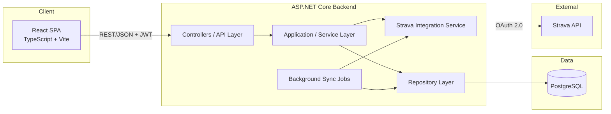
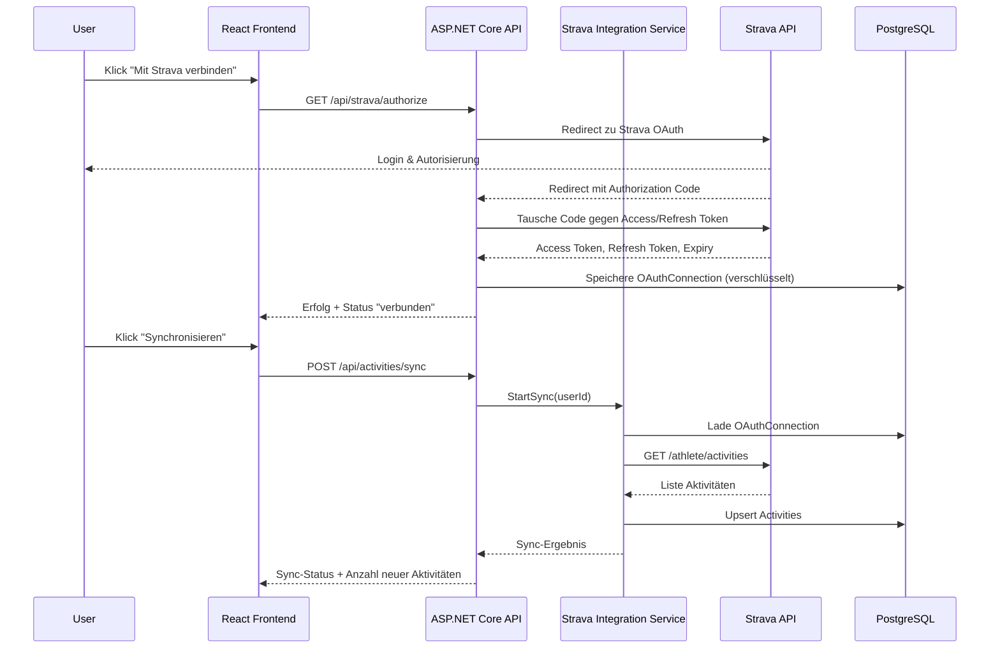
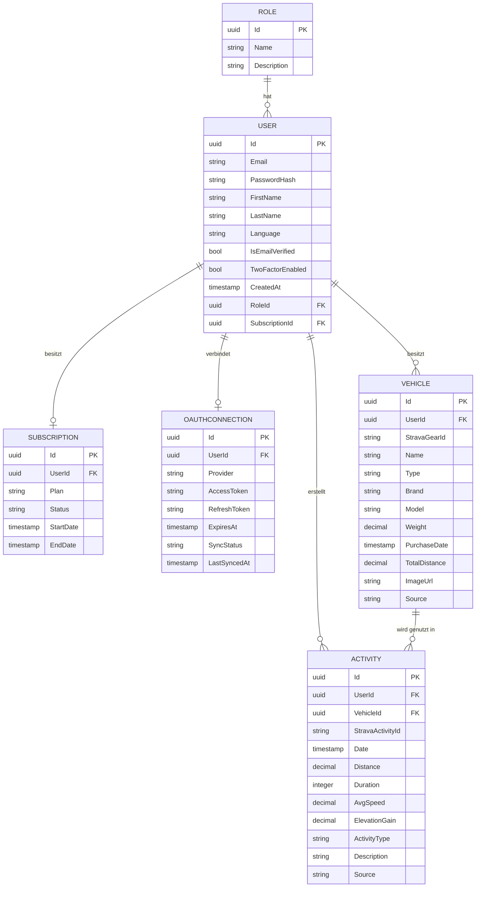
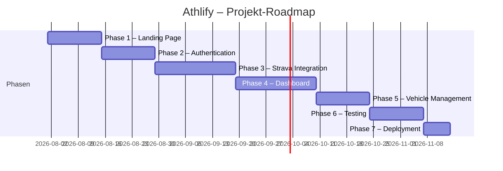
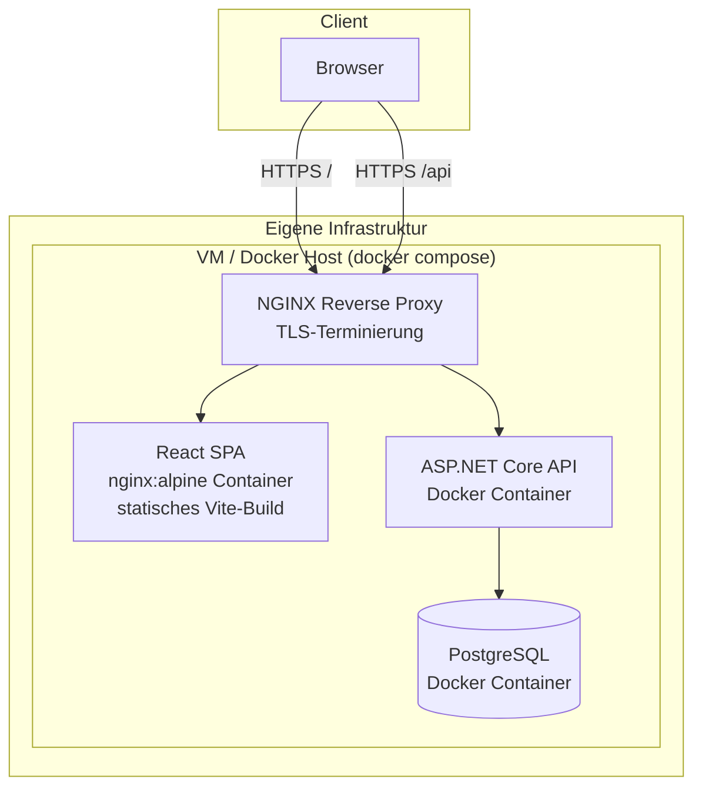
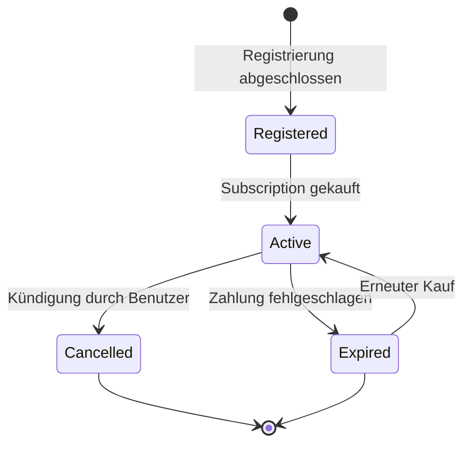
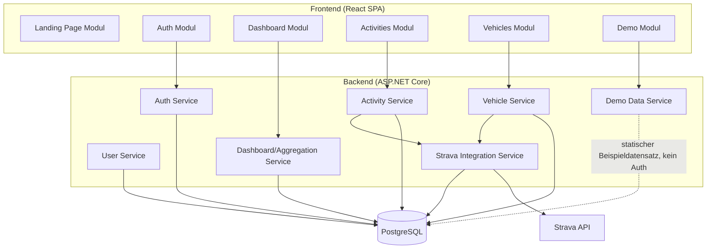

# Softwarekonzept Athlify

**Webbasierte Plattform zur Visualisierung und Analyse von Rad-Trainingsdaten**

| | |
|---|---|
| Projekt | Athlify |
| Kontext | CAS Frontend Engineering, OST – Ostschweizer Fachhochschule, Rapperswil |
| Dokumenttyp | Softwarekonzept / Projektdokumentation |
| Version | 1.4 |
| Datum | 26. Juli 2026 |
| Autor | Marco Ebneter |

---

## Inhaltsverzeichnis

1. [Management Summary](#1-management-summary)
2. [Projektübersicht](#2-projektübersicht)
3. [Technologie-Stack und Begründung](#3-technologie-stack-und-begründung)
4. [Funktionaler Projektumfang](#4-funktionaler-projektumfang)
5. [Rollen und Berechtigungen](#5-rollen-und-berechtigungen)
6. [Sicherheitsanforderungen](#6-sicherheitsanforderungen)
7. [Architektur](#7-architektur)
8. [Datenmodell](#8-datenmodell)
9. [API-Design](#9-api-design)
10. [Use Cases](#10-use-cases)
11. [User Stories](#11-user-stories)
12. [Nichtfunktionale Anforderungen](#12-nichtfunktionale-anforderungen)
13. [Wireframes](#13-wireframes)
14. [Projektstruktur](#14-projektstruktur)
15. [Risiken und Massnahmen](#15-risiken-und-massnahmen)
16. [Roadmap](#16-roadmap)
17. [Teststrategie](#17-teststrategie)
18. [Deployment](#18-deployment)
19. [Anhang: Ergänzende Diagramme](#19-anhang-ergänzende-diagramme)

---

## 1. Management Summary

Athlify ist eine webbasierte Anwendung zur Visualisierung und Analyse von Rad-Trainingsdaten. Die Applikation ist bewusst auf den Radsport fokussiert – andere Sportarten werden nicht unterstützt. Sie richtet sich an Radsportlerinnen und Radsportler, die ihre Fahrradaktivitäten – primär synchronisiert über die Strava API – in übersichtlichen, interaktiven Dashboards auswerten möchten. Neben der Synchronisation von Aktivitäten und Velos bietet Athlify die Möglichkeit, Daten manuell zu erfassen, zu bearbeiten und langfristig auszuwerten. Die Applikation ist durchgängig zweisprachig (Deutsch/Englisch) nutzbar.

Das Produkt besteht aus zwei klar getrennten Bereichen: einer öffentlichen, SEO-optimierten Marketing-Landing-Page zur Kundengewinnung sowie einer geschützten Applikation für registrierte Benutzer. Ein zeitlich unbefristeter, registrierungsfreier Demo-Modus mit vordefinierten Beispieldaten erlaubt es Interessenten, sich unverbindlich einen Eindruck von Athlify zu verschaffen, bevor sie sich registrieren und eine kostenpflichtige Subscription abschliessen.

Dieses Dokument beschreibt das vollständige Konzept von Athlify: die fachlichen Anforderungen, die technische Architektur, das Datenmodell, die API, sicherheitsrelevante Aspekte sowie die geplante Umsetzung im Rahmen des CAS-Projekts. Ziel ist es, eine belastbare Grundlage für Design, Implementierung und Bewertung des Projekts zu schaffen. Alle wesentlichen Entscheidungen werden nicht nur beschrieben, sondern auch begründet.

---

## 2. Projektübersicht

### 2.1 Ausgangslage

Radsportlerinnen und Radsportler, die Plattformen wie Strava nutzen, erhalten zwar eine solide Grunddokumentation ihrer Aktivitäten, jedoch nur eingeschränkte Möglichkeiten zur individuellen Auswertung, Langzeitanalyse und Verwaltung ihres Equipments (Velos). Athlify schliesst diese Lücke, indem es die über Strava verfügbaren Rohdaten mit zusätzlichen Auswertungsmöglichkeiten, einer flexiblen manuellen Datenpflege und einem persönlichen Dashboard kombiniert – mit klarem Fokus auf Radsport.

### 2.2 Zielsetzung

Athlify verfolgt folgende Hauptziele:

- Synchronisation von Strava-Radaktivitäten und -Velos in eine eigene, persistente Datenbasis.
- Bereitstellung aussagekräftiger Dashboards mit Kennzahlen, Verteilungen und Trends – ausschliesslich für Radsport-Aktivitäten.
- Ermöglichung manueller Datenpflege für Nutzer ohne oder mit ergänzendem Strava-Konto.
- Gewinnung neuer Kunden über eine ansprechende, informative Landing Page mit registrierungsfreiem Demo-Modus.
- Abbildung eines nachhaltigen Geschäftsmodells über kostenpflichtige Subscriptions.
- Durchgängige Mehrsprachigkeit (Deutsch/Englisch) der gesamten Applikation als verbindliche Kernanforderung.

### 2.3 Zielgruppe

Primäre Zielgruppe sind ambitionierte Freizeit- und Hobby-Radsportlerinnen und -sportler (Rennrad, Mountainbike, Gravel, Indoor-Cycling), die ihre Trainingsdaten strukturiert auswerten und ihr Bike-Equipment verwalten möchten. Andere Sportarten (z. B. Laufen, Wandern) liegen ausserhalb des Funktionsumfangs. Sekundär richtet sich Athlify an kleine Radsportgruppen oder Vereine, die eine einfache, zentrale Übersicht über Aktivitäten ihrer Mitglieder wünschen (ausserhalb des initialen Scopes, aber architektonisch nicht ausgeschlossen).

### 2.4 Abgrenzung

Athlify ist kein Ersatz für Strava, sondern ein ergänzendes Analyse- und Verwaltungswerkzeug. Es werden keine GPS-Tracks live aufgezeichnet; die Aufzeichnung von Aktivitäten erfolgt weiterhin über Strava oder kompatible Geräte. Athlify konsumiert die Strava API und reichert die Daten mit eigener Funktionalität an.

---

## 3. Technologie-Stack und Begründung

### 3.1 Übersicht

| Layer | Technologie | Begründung |
|---|---|---|
| Frontend | React + TypeScript + Vite | Komponentenbasiert, grosses Ökosystem, hervorragende TypeScript-Unterstützung, sehr schnelle Dev-Experience durch Vite (HMR, ESBuild) |
| Backend | ASP.NET Core (C#) | Siehe Abschnitt 3.3 |
| Datenbank | PostgreSQL | Robustes, relationales OSS-RDBMS mit exzellenter Unterstützung für komplexe Abfragen, JSON-Spalten und Skalierbarkeit |
| Externe API | Strava API | Zentrale Datenquelle für Aktivitäten und Fahrzeuge (Gear) |
| Authentifizierung | JWT + OAuth 2.0 (Strava) | Zustandslose API-Authentifizierung kombiniert mit OAuth-Flow für Strava |

### 3.2 Frontend: React, TypeScript, Vite

React wurde gewählt, da es sich um das im Kursumfeld (CAS Frontend Engineering) vertiefte Framework handelt und sich durch seine deklarative, komponentenbasierte Architektur ideal für datengetriebene Dashboards eignet. TypeScript reduziert Laufzeitfehler durch statische Typprüfung, was insbesondere bei der Verarbeitung komplexer, verschachtelter API-Antworten (Strava-Payloads) einen klaren Mehrwert bietet. Vite ersetzt klassische Bundler wie Webpack durch einen nativen ESM-basierten Dev-Server mit sehr kurzen Startzeiten und schnellem Hot Module Replacement, was die Entwicklungsproduktivität im Rahmen des zeitlich begrenzten CAS-Projekts erhöht.

### 3.3 Backend: ASP.NET Core vs. Next.js

Zur Wahl standen ASP.NET Core (C#) und Next.js (TypeScript). Beide Varianten sind technisch geeignet; die Entscheidung fiel aus folgenden Gründen auf **ASP.NET Core**:

| Kriterium                         | ASP.NET Core                                                                                                  | Next.js                                                                                               |
| --------------------------------- | ------------------------------------------------------------------------------------------------------------- | ----------------------------------------------------------------------------------------------------- |
| Trennung Frontend/Backend         | Klare Trennung, eigenständige Web-API                                                                         | Vermischt Frontend- und Backend-Verantwortlichkeiten (API Routes)                                     |
| Typsicherheit im Backend          | Stark typisiert (C#), robustes Typsystem, Compile-Time-Checks                                                 | TypeScript im Backend möglich, aber weniger strikt als C# im Enterprise-Kontext                       |
| ORM / Datenzugriff                | Entity Framework Core mit ausgereiften Migrations- und LINQ-Fähigkeiten                                       | Meist Prisma oder Drizzle, funktional vergleichbar, aber weniger etabliert im Enterprise-Umfeld       |
| Skalierbarkeit / Performance      | Hervorragende Performance bei I/O- und CPU-intensiven Operationen (z. B. Batch-Sync grosser Aktivitätsmengen) | Node.js Single-Thread-Modell, für I/O-lastige Workloads gut, bei CPU-lastigen Aggregationen limitiert |
| Ökosystem für Enterprise-Patterns | Native Unterstützung für Dependency Injection, Middleware-Pipeline, Repository-Pattern, Clean Architecture    | Möglich, aber weniger konventionsgetrieben                                                            |
| Lernrelevanz im CAS-Kontext       | Demonstriert bewusste Trennung von SPA-Frontend und Web-API-Backend, wie im Modul gefordert                   | Next.js verwischt diese Trennung durch SSR/API-Hybridansatz                                           |
| Deployment                        | Docker-Container, unabhängig skalierbar                                                                       | Vercel-optimiert, aber auch containerisierbar                                                         |

Die explizite Trennung von Frontend (React SPA) und Backend (ASP.NET Core Web API) entspricht der Zielsetzung des CAS-Moduls, eine moderne Frontend-Architektur mit einer sauber getrennten Backend-Schicht zu kombinieren. Zusätzlich bringt C#/.NET ein reifes Typsystem, ausgereifte Tools für Authentifizierung (ASP.NET Core Identity), Hintergrundjobs (Hosted Services für die Strava-Synchronisation) und eine performante Verarbeitung grösserer Datenmengen mit, was für die geplanten Dashboard-Aggregationen relevant ist.

### 3.4 Datenbank: PostgreSQL

PostgreSQL wurde gewählt, da es sich um ein leistungsfähiges, quelloffenes RDBMS handelt, das komplexe relationale Modelle (User, Aktivitäten, Fahrzeuge, Subscriptions) sauber abbildet, gleichzeitig aber auch JSONB-Spalten für halbstrukturierte Strava-Rohdaten unterstützt. Es bietet ausserdem hervorragende Unterstützung für zeitreihenbasierte Aggregationen (Distanz pro Monat, Heatmaps), die für die Dashboard-Funktionalität zentral sind.

### 3.5 Externe API: Strava

Die Strava API (https://www.strava.com/) stellt die primäre externe Datenquelle dar. Sie liefert über OAuth 2.0 autorisierten Zugriff auf Aktivitäten (`/athlete/activities`), Ausrüstung/Gear (`/gear/{id}`) sowie Athletenprofile (`/athlete`). Die Integration erfolgt über einen dedizierten Backend-Service, der Tokens verwaltet, Rate Limits respektiert und Daten in die eigene Datenbank überführt (siehe Abschnitt 7.5).

---

## 4. Funktionaler Projektumfang

### 4.1 Öffentliche Landing Page

Die Landing Page ist öffentlich zugänglich (kein Login erforderlich) und dient primär der Kundengewinnung. Sie umfasst folgende Bereiche:

| Seite | Zweck |
|---|---|
| Startseite | Value Proposition, Hero-Bereich, Call-to-Action (Registrierung/Demo) |
| Features | Übersicht der Kernfunktionen (Sync, Dashboard, Fahrzeugverwaltung) |
| Pricing | Übersicht der Subscription-Modelle (z. B. Monatlich, Jährlich) |
| Screenshots | Visuelle Eindrücke der Applikation (Dashboard, Aktivitätsliste) |
| FAQ | Häufige Fragen zu Datenschutz, Strava-Anbindung, Abrechnung |
| Kontakt | Kontaktformular für Support- und Sales-Anfragen |
| Login | Zugang zur bestehenden Applikation |
| Registrierung | Anlage eines neuen Benutzerkontos |
| Testzugang | Registrierungsfreier, zeitlich unbefristeter Demo-Modus mit Beispieldaten |

Die Landing Page wird als statisch-optimierter Bereich der React-Anwendung umgesetzt (separates Routing, kein Auth-Context erforderlich), um kurze Ladezeiten und gute SEO-Werte zu gewährleisten.

### 4.2 Login und Registrierung

- Registrierung mit E-Mail und Passwort.
- Login mit E-Mail/Passwort, Ausstellung eines JWT Access Tokens sowie eines Refresh Tokens.
- **Passwort vergessen**: Versand eines zeitlich limitierten Reset-Links per E-Mail.
- **E-Mail-Verifizierung**: Bestätigung der E-Mail-Adresse nach Registrierung via Verifizierungslink, bevor der Account vollständig freigeschaltet wird.
- **Demo-Zugang**: Interessenten können ohne Registrierung und ohne zeitliche Begrenzung den Demo-Modus nutzen. Dieser zeigt die Applikation (Dashboard, Aktivitäten, Fahrzeuge) ausschliesslich mit vordefinierten, fiktiven Beispieldaten – es wird kein Konto angelegt und es werden keine echten Benutzerdaten verarbeitet (siehe Abschnitt 5.3).

### 4.3 User Management

Jeder Benutzer verfügt über folgende Datenbereiche:

- **Profil**: Name, E-Mail, Sprache, Profilbild (optional).
- **Passwort**: Gehasht gespeichert, änderbar über Settings.
- **Subscription**: Aktueller Plan, Status (aktiv, abgelaufen, gekündigt), Ablaufdatum.
- **Sprache**: Bevorzugte UI-Sprache (DE/EN)
- **Strava-Verbindung**: OAuth-Verknüpfung mit Access Token, Refresh Token, Ablaufdatum und Synchronisationsstatus.
- **Two-Factor-Authentication** (optional): Zusätzliche Absicherung des Logins über TOTP.

### 4.4 Activity Management

Athlify ist ausschliesslich auf Radsport-Aktivitäten ausgerichtet (Rennrad, Mountainbike, Gravel, Indoor-Cycling/Rolle); andere Sportarten werden nicht unterstützt und sind auch datenmodellseitig nicht vorgesehen. Aktivitäten stammen entweder aus Strava (via Synchronisation) oder werden manuell erfasst. Funktionsumfang:

- **Synchronisieren**: Abruf neuer/aktualisierter Rad-Aktivitäten aus Strava.
- **Anzeigen**: Liste und Detailansicht pro Aktivität.
- **Bearbeiten**: Änderung von Metadaten (z. B. Beschreibung, verknüpftes Fahrzeug) – bei Strava-Aktivitäten eingeschränkt auf lokal verwaltete Zusatzfelder.
- **Löschen**: Entfernen aus Athlify (ohne Rückwirkung auf Strava).
> [!comment] Marco | 26/07/2026
> Löschen aus Strava evtl. möglich machen da sonst beim nächsten Import diese Aktivität wider erscheint
- **Manuell hinzufügen**: Erfassen von Aktivitäten ohne Strava-Ursprung (z. B. Indoor-Training).

Attribute einer Aktivität: Datum, Distanz, Dauer, Durchschnittsgeschwindigkeit, Höhenmeter, Aktivitätstyp (Rennrad, Mountainbike, Gravel, Indoor/Rolle), Beschreibung, verknüpftes Fahrzeug (Bike), Quelle (Strava/Manuell).

### 4.5 Vehicle Management

Fahrzeuge (primär Velos) können aus Strava synchronisiert oder manuell erfasst werden. Funktionsumfang: Anzeigen, Erstellen, Bearbeiten, Löschen, Synchronisieren. Optional: Verwaltung mehrerer Bilder pro Fahrzeug.

Attribute eines Fahrzeugs: Name, Typ, Marke, Modell, Gewicht, Kaufdatum, gefahrene Kilometer, Bild.

### 4.6 Dashboard

Das Dashboard ist die zentrale Ansicht der Applikation und visualisiert die aggregierten Daten des Benutzers über konfigurierbare Widgets:

- Gesamtaktivitäten, Gesamtdistanz, Höhenmeter, Trainingszeit
- Aktivitätsverteilung (nach Aktivitätstyp, z. B. Rennrad, MTB, Gravel, Indoor)
- Distanz pro Monat, Distanz pro Bike
- Durchschnittsgeschwindigkeit
- Aktivitätskalender, Heatmap
- Top Aktivitäten, Bike-Nutzung

Das Dashboard ist vollständig zweisprachig (DE/EN) umzusetzen. Optional/erweiterbar: Vergleich zweier Zeiträume, PDF-Report-Export, CSV-Export.

---

## 5. Rollen und Berechtigungen

### 5.1 Rollenübersicht

| Rolle         | Beschreibung                                                                                                 |
| ------------- | ------------------------------------------------------------------------------------------------------------ |
| Administrator | Vollzugriff auf Systemverwaltung, Benutzerverwaltung und alle Daten                                          |
| Normal User   | Vollzugriff auf eigene Daten (Aktivitäten, Fahrzeuge, Dashboard, Strava-Verbindung)                          |
| Guest         | Kein Login; Zugriff auf öffentliche Landing Page sowie den registrierungsfreien Demo-Modus mit Beispieldaten |

Athlify verzichtet bewusst auf eine eigene "Trial User"-Rolle mit Benutzerkonto. Stattdessen steht Interessenten ein unbefristeter, registrierungsfreier Demo-Modus zur Verfügung (siehe Abschnitt 5.3), der ohne Datenbank-User auskommt.

### 5.2 Berechtigungsmatrix

| Funktion                          | Guest |         Demo-Modus (ohne Login)         | Normal User | Administrator |
| --------------------------------- | :---: | :-------------------------------------: | :---------: | :-----------: |
| Landing Page ansehen              |   ✅   |                    ✅                    |      ✅      |       ✅       |
| Demo-Modus nutzen (Beispieldaten) |   ✅   |                    ✅                    |      –      |       –       |
| Registrieren                      |   ✅   |                    ✅                    |      –      |       –       |
| Login                             |   –   |                    –                    |      ✅      |       ✅       |
| Strava verbinden                  |   –   |                    –                    |      ✅      |       ✅       |
| Aktivitäten synchronisieren       |   –   |                    –                    |      ✅      |       ✅       |
| Aktivitäten manuell erfassen      |   –   | ✅ (nicht persistent, nur Beispieldaten) |      ✅      |       ✅       |
| Aktivitäten bearbeiten/löschen    |   –   |          ✅ (nicht persistent)           | ✅ (eigene)  |   ✅ (alle)    |
| Fahrzeuge verwalten               |   –   |          ✅ (nicht persistent)           |      ✅      |       ✅       |
| Dashboard ansehen                 |   –   |            ✅ (Beispieldaten)            |      ✅      |       ✅       |
| PDF/CSV-Export                    |   –   |                    –                    |      ✅      |       ✅       |
| Subscription kaufen/verwalten     |   –   |                    –                    |      ✅      |       ✅       |
| Eigenes Profil verwalten          |   –   |                    –                    |      ✅      |       ✅       |
| Benutzerverwaltung (alle User)    |   –   |                    –                    |      –      |       ✅       |
| Systemeinstellungen               |   –   |                    –                    |      –      |       ✅       |
| Rollen zuweisen                   |   –   |                    –                    |      –      |       ✅       |

### 5.3 Demo-Modus

Um Interessenten einen unkomplizierten, risikofreien Einblick in Athlify zu ermöglichen, steht ein öffentlich zugänglicher Demo-Modus zur Verfügung:

- Kein Konto und keine Registrierung erforderlich.
- Zeitlich unbefristet nutzbar (kein Ablaufdatum, keine Testphase).
- Zeigt Dashboard, Aktivitäten und Fahrzeuge ausschliesslich mit einem festen, fiktiven Beispieldatensatz (Seed-Daten) – es werden zu keinem Zeitpunkt echte Benutzerdaten angelegt, verändert oder gespeichert.
- Keine Verbindung zu Strava.
- Schreibende Aktionen (z. B. Aktivität hinzufügen) sind entweder deaktiviert oder wirken nur innerhalb der aktuellen Browser-Session, ohne die Beispieldaten dauerhaft zu verändern.
- Dient ausschliesslich der Navigation und Veranschaulichung des Funktionsumfangs vor einer Registrierung.

Technisch wird der Demo-Modus über dedizierte, nicht authentifizierte API-Endpunkte realisiert, die stets denselben Beispieldatensatz zurückliefern (siehe Abschnitt 9.8).

---

## 6. Sicherheitsanforderungen

Athlify verarbeitet personenbezogene und potenziell sensible Trainingsdaten sowie OAuth-Tokens Dritter. Entsprechend hoch sind die Anforderungen an die Applikationssicherheit.

### 6.1 Authentifizierung

Die Authentifizierung erfolgt über E-Mail/Passwort mit anschliessender Ausstellung eines **JWT Access Tokens** (kurzlebig, z. B. 15 Minuten) sowie eines **Refresh Tokens** (langlebig, z. B. 7–30 Tage, serverseitig widerrufbar). Der Access Token wird bei jedem API-Aufruf im `Authorization: Bearer`-Header mitgesendet. Optional wird Two-Factor-Authentication (TOTP) als zweiter Faktor unterstützt.

### 6.2 Autorisierung

Die Autorisierung erfolgt rollenbasiert (RBAC) über Policies in ASP.NET Core (`[Authorize(Roles = "Admin")]` bzw. Policy-basierte Handler für feingranulare Regeln wie "nur eigene Ressourcen"). Jede API-Anfrage wird sowohl auf Authentifizierung als auch auf Ressourcen-Eigentümerschaft geprüft (z. B. darf ein Normal User nur eigene Aktivitäten bearbeiten).

### 6.3 OAuth mit Strava

Die Strava-Anbindung nutzt den OAuth-2.0-Authorization-Code-Flow. Der Benutzer wird zu Strava weitergeleitet, autorisiert den Zugriff, und Athlify erhält einen Authorization Code, der serverseitig gegen Access und Refresh Token getauscht wird. Tokens werden verschlüsselt in der Datenbank gespeichert und automatisiert erneuert, bevor sie ablaufen.

### 6.4 Passwort-Sicherheit

Passwörter werden nie im Klartext gespeichert, sondern mittels eines adaptiven Hashing-Algorithmus (BCrypt bzw. ASP.NET Core Identity PasswordHasher, basierend auf PBKDF2 mit Salt) gehasht.

### 6.5 Transportsicherheit

Sämtliche Kommunikation erfolgt ausschliesslich über **HTTPS** (TLS 1.2+). HTTP-Anfragen werden serverseitig auf HTTPS umgeleitet; HSTS wird aktiviert.

### 6.6 Weitere Schutzmassnahmen

| Massnahme            | Umsetzung                                                                                                                                                                                                                                              |
| -------------------- | ------------------------------------------------------------------------------------------------------------------------------------------------------------------------------------------------------------------------------------------------------ |
| CORS                 | Restriktive CORS-Policy, die nur die eigene Frontend-Domain zulässt                                                                                                                                                                                    |
| Rate Limiting        | Begrenzung der API-Aufrufe pro User/IP (z. B. via ASP.NET Core Rate Limiting Middleware), insbesondere für Login-, Sync- und die unauthentifizierten Demo-Endpunkte (Missbrauchsschutz, da ohne Login erreichbar)                                      |
| Input Validation     | Serverseitige Validierung aller Eingaben (FluentValidation/DataAnnotations), zusätzlich clientseitige Validierung als UX-Massnahme                                                                                                                     |
| SQL-Injection-Schutz | Ausschliessliche Nutzung von Entity Framework Core mit parametrisierten Queries, keine dynamische SQL-Konkatenation                                                                                                                                    |
| XSS-Schutz           | Konsequentes Escaping/Encoding von Ausgaben, React's eingebauter JSX-Escaping-Mechanismus, striktes Content-Security-Policy-Header                                                                                                                     |
| CSRF-Schutz          | Da die API zustandslos über Bearer-Token arbeitet (kein Cookie-basiertes Session-Handling), ist die klassische CSRF-Angriffsfläche reduziert; bei Einsatz von Cookies (z. B. Refresh Token) werden `SameSite=Strict` sowie Anti-CSRF-Tokens eingesetzt |
| Secrets Management   | API-Keys und Strava Client Secret werden über Umgebungsvariablen/Secret Stores verwaltet, nie im Repository                                                                                                                                            |

---

## 7. Architektur

### 7.1 Architekturübersicht

Athlify folgt einer klassischen Drei-Schichten-Architektur mit klar getrenntem Frontend (SPA), Backend (Web-API) und Datenbank. Die Kommunikation erfolgt über eine versionierte REST-API im JSON-Format.



### 7.2 Frontend-Architektur

Das Frontend ist als Single Page Application mit React, TypeScript und Vite umgesetzt. Es folgt einer feature-basierten Ordnerstruktur (statt rein technischer Trennung), um Kohäsion pro Fachlichkeit (z. B. Activities, Vehicles, Dashboard) zu maximieren.

Zentrale Konzepte:

- **Routing**: React Router mit getrennten Routen-Bäumen für öffentliche Landing Page und geschützte Applikation (Auth Guard).
- **State Management**: Lokaler Komponentenstate für UI-State, React Query (TanStack Query) für Server-State (Caching, Refetching, Optimistic Updates der API-Daten).
- **Auth Context**: Globaler Context zur Verwaltung von Access Token, aktuellem Benutzer und Rollen; automatisches Token-Refresh via Interceptor.
- **Komponentenstruktur**: Trennung in `pages` (Routen-Ebene), `components` (wiederverwendbare UI-Bausteine), `features` (fachliche Module mit eigener Logik/API-Anbindung) und `shared` (Utilities, Hooks, Types).
- **Styling**: Utility-first CSS-Framework (z. B. Tailwind CSS) für konsistentes, schnelles UI-Development.

### 7.3 Backend-Architektur

Das Backend folgt einer Clean-Architecture-inspirierten Schichtenteilung:

- **API Layer (Controllers)**: Nimmt HTTP-Requests entgegen, validiert Eingaben, delegiert an die Service-Schicht, gibt DTOs zurück.
- **Application/Service Layer**: Enthält die fachliche Logik (z. B. Synchronisationslogik, Dashboard-Aggregationen, Subscription-Handling).
- **Repository Layer**: Kapselt den Datenzugriff über Entity Framework Core; abstrahiert die konkrete Datenbanktechnologie von der Business-Logik (Repository Pattern).
- **Domain Layer**: Enthält Entities, Enums und Domain-Regeln, unabhängig von Infrastruktur.
- **Infrastructure Layer**: Enthält konkrete Implementierungen wie den Strava-API-Client, E-Mail-Versand, Token-Verschlüsselung.
- **Demo Data Service**: Liefert über nicht authentifizierte Endpunkte einen statischen, vordefinierten Beispieldatensatz für den Demo-Modus aus; greift nicht auf echte Benutzerdaten zu.

Dependency Injection (nativ in ASP.NET Core) verbindet die Schichten lose gekoppelt; Interfaces (`IActivityRepository`, `IStravaClient`) ermöglichen Testbarkeit durch Mocking.

### 7.4 Datenfluss und API-Kommunikation

1. Das Frontend authentifiziert sich über `/api/auth/login` und erhält Access + Refresh Token.
2. Nachfolgende Anfragen senden den Access Token im `Authorization`-Header.
3. Der Server validiert das Token (Middleware), löst den Benutzerkontext auf und autorisiert den Zugriff.
4. Anfragen an fachliche Endpunkte (z. B. `/api/activities`) durchlaufen Controller → Service → Repository → Datenbank.
5. Läuft der Access Token ab, nutzt das Frontend automatisiert `/api/auth/refresh`, um ein neues Token-Paar zu erhalten.

### 7.5 Strava-Integration

Die Strava-Integration ist als eigenständiger Infrastruktur-Service (`StravaIntegrationService`) gekapselt und übernimmt:

- Verwaltung des OAuth-Flows (Autorisierung, Token-Austausch, Token-Refresh).
- Abruf von Aktivitäten und Gear via Strava REST API.
- Mapping der Strava-Datenstrukturen auf das interne Domänenmodell.
- Steuerung von Rate Limits (Strava begrenzt Anfragen pro 15-Minuten-Fenster und pro Tag) inklusive Backoff-Strategie.

Die Synchronisation kann sowohl manuell (Button "Synchronisieren") als auch automatisiert über einen Hintergrunddienst (Hosted Service / Background Job, z. B. mit Hangfire oder .NET `IHostedService`) periodisch ausgelöst werden.



### 7.6 Repository Pattern

Der Datenzugriff wird konsequent über Repositories gekapselt (`IActivityRepository`, `IVehicleRepository`, `IUserRepository`), die von Entity Framework Core Implementierungen umgesetzt werden. Dies erlaubt:

- Austauschbarkeit der Persistenzschicht (z. B. für Tests mit In-Memory-Datenbank).
- Zentrale Kapselung von Query-Logik (z. B. Aggregationen für das Dashboard).
- Klare Trennung zwischen Domänenlogik und ORM-spezifischem Code.

### 7.7 Mögliche Ordnerstruktur

```
athlify/
├── frontend/
│   ├── src/
│   │   ├── app/                 # App-Setup, Router, Providers
│   │   ├── pages/                # Routen-Level Komponenten (Landing, Dashboard, ...)
│   │   ├── features/
│   │   │   ├── auth/
│   │   │   ├── activities/
│   │   │   ├── vehicles/
│   │   │   ├── dashboard/
│   │   │   └── settings/
│   │   ├── components/           # Wiederverwendbare UI-Komponenten
│   │   ├── shared/
│   │   │   ├── api/               # API-Client, React Query Hooks
│   │   │   ├── hooks/
│   │   │   ├── types/
│   │   │   └── utils/
│   │   ├── i18n/                  # Übersetzungen DE/EN
│   │   └── main.tsx
│   ├── index.html
│   └── vite.config.ts
├── backend/
│   ├── src/
│   │   ├── Athlify.Api/            # Controllers, Middleware, Program.cs
│   │   ├── Athlify.Application/    # Services, DTOs, Interfaces
│   │   ├── Athlify.Domain/         # Entities, Enums, Domain-Logik
│   │   └── Athlify.Infrastructure/ # EF Core, Strava-Client, Repositories
│   └── tests/
│       ├── Athlify.UnitTests/
│       └── Athlify.IntegrationTests/
├── database/
│   ├── migrations/
│   └── seed/
└── docs/
    └── Athlify_Konzept.md
```

---

## 8. Datenmodell

### 8.1 Entitäten und Attribute

**User**

| Feld                 | Typ            | Beschreibung                |
| -------------------- | -------------- | --------------------------- |
| Id (PK)              | UUID           | Eindeutiger Identifier      |
| Email                | string         | Eindeutig, für Login        |
| PasswordHash         | string         | Gehashtes Passwort          |
| FirstName / LastName | string         | Profildaten                 |
| Language             | enum (DE, EN)  | UI-Sprache                  |
| IsEmailVerified      | bool           | E-Mail-Verifizierungsstatus |
| TwoFactorEnabled     | bool           | 2FA-Status                  |
| CreatedAt            | timestamp      | Erstellungsdatum            |
| RoleId (FK)          | UUID           | Verweis auf Role            |
| SubscriptionId (FK)  | UUID, nullable | Verweis auf Subscription    |

**Role**

| Feld        | Typ    | Beschreibung              |
| ----------- | ------ | ------------------------- |
| Id (PK)     | UUID   | Eindeutiger Identifier    |
| Name        | string | Administrator, NormalUser |
| Description | string | Beschreibung der Rolle    |

**Subscription**

| Feld        | Typ       | Beschreibung               |
| ----------- | --------- | -------------------------- |
| Id (PK)     | UUID      | Eindeutiger Identifier     |
| UserId (FK) | UUID      | Zugehöriger Benutzer       |
| Plan        | enum      | Monthly, Yearly            |
| Status      | enum      | Active, Expired, Cancelled |
| StartDate   | timestamp | Beginn                     |
| EndDate     | timestamp | Ablaufdatum                |

**OAuthConnection**

| Feld         | Typ                    | Beschreibung                            |
| ------------ | ---------------------- | --------------------------------------- |
| Id (PK)      | UUID                   | Eindeutiger Identifier                  |
| UserId (FK)  | UUID                   | Zugehöriger Benutzer                    |
| Provider     | enum                   | Strava (erweiterbar)                    |
| AccessToken  | string (verschlüsselt) | Aktueller Access Token                  |
| RefreshToken | string (verschlüsselt) | Refresh Token                           |
| ExpiresAt    | timestamp              | Ablaufzeitpunkt des Access Tokens       |
| SyncStatus   | enum                   | NotConnected, Connected, Syncing, Error |
| LastSyncedAt | timestamp, nullable    | Zeitpunkt der letzten Synchronisation   |

**Activity**

| Feld | Typ | Beschreibung |
|---|---|---|
| Id (PK) | UUID | Eindeutiger Identifier |
| UserId (FK) | UUID | Zugehöriger Benutzer |
| VehicleId (FK) | UUID, nullable | Verwendetes Fahrzeug |
| StravaActivityId | string, nullable | Externe Referenz-ID (falls synchronisiert) |
| Date | timestamp | Datum der Aktivität |
| Distance | decimal | Distanz in km |
| Duration | integer | Dauer in Sekunden |
| AvgSpeed | decimal | Durchschnittsgeschwindigkeit |
| ElevationGain | decimal | Höhenmeter |
| ActivityType | enum | Rennrad, Mountainbike, Gravel, Indoor/Rolle, Sonstige (ausschliesslich Radsport-Disziplinen) |
| Description | string | Freitext |
| Source | enum | Strava, Manual |

**Vehicle**

| Feld | Typ | Beschreibung |
|---|---|---|
| Id (PK) | UUID | Eindeutiger Identifier |
| UserId (FK) | UUID | Zugehöriger Benutzer |
| StravaGearId | string, nullable | Externe Referenz-ID |
| Name | string | Bezeichnung |
| Type | enum | Rennrad, Mountainbike, Gravel, etc. |
| Brand | string | Marke |
| Model | string | Modell |
| Weight | decimal | Gewicht in kg |
| PurchaseDate | timestamp | Kaufdatum |
| TotalDistance | decimal | Gefahrene Kilometer |
| ImageUrl | string, nullable | Bild-URL |
| Source | enum | Strava, Manual |

### 8.2 Beziehungen

- Ein `User` besitzt genau eine `Role` (n:1).
- Ein `User` besitzt maximal eine aktive `Subscription` (1:1, historisch 1:n für vergangene Subscriptions).
- Ein `User` besitzt maximal eine `OAuthConnection` pro Provider (1:1 pro Provider).
- Ein `User` besitzt beliebig viele `Activity`- und `Vehicle`-Einträge (1:n).
- Eine `Activity` kann optional genau einem `Vehicle` zugeordnet sein (n:1, nullable).

### 8.3 ER-Diagramm



---

## 9. API-Design

Die API folgt REST-Konventionen, ist versioniert (`/api/v1/...`, hier zur Übersichtlichkeit ohne Versionspräfix dargestellt) und liefert/erwartet JSON.

### 9.1 Auth

| Methode | Endpunkt                    | Beschreibung                           |
| ------- | --------------------------- | -------------------------------------- |
| POST    | `/api/auth/register`        | Neuen Benutzer registrieren            |
| POST    | `/api/auth/login`           | Login, liefert Access + Refresh Token  |
| POST    | `/api/auth/logout`          | Refresh Token invalidieren             |
| POST    | `/api/auth/refresh`         | Neues Token-Paar anhand Refresh Token  |
| POST    | `/api/auth/forgot-password` | Passwort-Reset anstossen (optional)    |
| POST    | `/api/auth/reset-password`  | Neues Passwort setzen (optional)       |
| GET     | `/api/auth/verify-email`    | E-Mail-Adresse verifizieren (optional) |

### 9.2 User

| Methode | Endpunkt                 | Beschreibung                                     |
| ------- | ------------------------ | ------------------------------------------------ |
| GET     | `/api/users/me`          | Eigenes Profil abrufen                           |
| PUT     | `/api/users/me`          | Eigenes Profil aktualisieren                     |
| PUT     | `/api/users/me/password` | Passwort ändern                                  |
| GET     | `/api/users`             | Alle Benutzer auflisten (nur Administrator)      |
| PUT     | `/api/users/{id}/role`   | Rolle eines Benutzers ändern (nur Administrator) |
| DELETE  | `/api/users/{id}`        | Benutzer löschen (nur Administrator)             |

### 9.3 Strava / OAuth

| Methode | Endpunkt | Beschreibung |
|---|---|---|
| GET | `/api/strava/authorize` | Startet OAuth-Flow, Redirect zu Strava |
| GET | `/api/strava/callback` | OAuth-Callback, Token-Austausch |
| DELETE | `/api/strava/disconnect` | Strava-Verbindung trennen |
| GET | `/api/strava/status` | Aktuellen Verbindungs-/Sync-Status abrufen |

### 9.4 Activities

| Methode | Endpunkt | Beschreibung |
|---|---|---|
| GET | `/api/activities` | Aktivitäten auflisten (Filter, Pagination) |
| GET | `/api/activities/{id}` | Einzelne Aktivität abrufen |
| POST | `/api/activities` | Aktivität manuell erstellen |
| PUT | `/api/activities/{id}` | Aktivität bearbeiten |
| DELETE | `/api/activities/{id}` | Aktivität löschen |
| POST | `/api/activities/sync` | Synchronisation mit Strava anstossen |

### 9.5 Vehicles

| Methode | Endpunkt | Beschreibung |
|---|---|---|
| GET | `/api/vehicles` | Fahrzeuge auflisten |
| GET | `/api/vehicles/{id}` | Einzelnes Fahrzeug abrufen |
| POST | `/api/vehicles` | Fahrzeug erstellen |
| PUT | `/api/vehicles/{id}` | Fahrzeug bearbeiten |
| DELETE | `/api/vehicles/{id}` | Fahrzeug löschen |
| POST | `/api/vehicles/sync` | Fahrzeuge mit Strava synchronisieren |

### 9.6 Dashboard

| Methode | Endpunkt | Beschreibung |
|---|---|---|
| GET | `/api/dashboard` | Aggregierte Übersicht (Widgets) |
| GET | `/api/dashboard/statistics` | Detaillierte statistische Auswertungen |
| GET | `/api/dashboard/export/pdf` | PDF-Report generieren (optional) |
| GET | `/api/dashboard/export/csv` | CSV-Export generieren (optional) |

### 9.7 Subscription

| Methode | Endpunkt | Beschreibung |
|---|---|---|
| GET | `/api/subscriptions/plans` | Verfügbare Pläne auflisten |
| POST | `/api/subscriptions/checkout` | Kaufprozess starten |
| GET | `/api/subscriptions/me` | Eigene Subscription abrufen |
| POST | `/api/subscriptions/cancel` | Subscription kündigen |

### 9.8 Demo

| Methode | Endpunkt | Beschreibung |
|---|---|---|
| GET | `/api/demo/dashboard` | Dashboard-Aggregationen mit fixem Beispieldatensatz (kein Auth erforderlich) |
| GET | `/api/demo/activities` | Beispiel-Aktivitäten auflisten (kein Auth erforderlich) |
| GET | `/api/demo/vehicles` | Beispiel-Fahrzeuge auflisten (kein Auth erforderlich) |

Die Demo-Endpunkte sind rein lesend, erfordern keine Authentifizierung und liefern stets denselben, serverseitig vordefinierten Beispieldatensatz zurück.

---

## 10. Use Cases

### UC-01 Registrierung

- **Ziel**: Ein neuer Benutzer erstellt ein Konto.
- **Akteure**: Guest
- **Voraussetzungen**: Gültige, noch nicht registrierte E-Mail-Adresse.
- **Hauptablauf**: (1) Guest öffnet Registrierungsformular. (2) Eingabe von E-Mail, Passwort, Name. (3) System validiert Eingaben. (4) Konto wird angelegt, Passwort gehasht gespeichert. (5) Bestätigungs-E-Mail wird versendet.
- **Alternativen**: E-Mail bereits vergeben → Fehlermeldung mit Hinweis auf Login.
- **Fehlerfälle**: Ungültiges Passwortformat, Serverfehler beim Speichern.
- **Ergebnis**: Neues Benutzerkonto mit Rolle "NormalUser" existiert.

### UC-02 Login

- **Ziel**: Ein registrierter Benutzer meldet sich an.
- **Akteure**: NormalUser, Administrator
- **Voraussetzungen**: Bestehendes, aktives Benutzerkonto.
- **Hauptablauf**: (1) Benutzer gibt E-Mail und Passwort ein. (2) System prüft Zugangsdaten. (3) Bei Erfolg werden Access- und Refresh-Token ausgestellt. (4) Benutzer wird ins Dashboard weitergeleitet.
- **Alternativen**: 2FA aktiviert → zusätzlicher TOTP-Prompt vor Ausstellung der Tokens.
- **Fehlerfälle**: Falsches Passwort, gesperrtes Konto, nicht verifizierte E-Mail.
- **Ergebnis**: Benutzer ist authentifiziert und erhält Zugriff auf die Applikation.

### UC-03 Demo-Modus nutzen

- **Ziel**: Ein Interessent verschafft sich ohne Registrierung einen Eindruck von Athlify anhand von Beispieldaten.
- **Akteure**: Guest
- **Voraussetzungen**: Keine.
- **Hauptablauf**: (1) Guest klickt auf der Landing Page auf "Testzugang". (2) System lädt Dashboard, Aktivitäten und Fahrzeuge über die unauthentifizierten Demo-Endpunkte mit einem festen, fiktiven Beispieldatensatz. (3) Guest navigiert beliebig lange und ohne zeitliche Begrenzung durch die Applikation.
- **Alternativen**: Guest entscheidet sich, sich zu registrieren, um mit echten, eigenen Daten zu arbeiten.
- **Fehlerfälle**: Technischer Fehler beim Laden des Beispieldatensatzes.
- **Ergebnis**: Guest hat den Funktionsumfang von Athlify anhand von Beispieldaten kennengelernt, ohne dass ein Konto angelegt oder echte Daten verändert wurden.

### UC-04 Strava verbinden

- **Ziel**: Der Benutzer verknüpft sein Athlify-Konto mit Strava.
- **Akteure**: NormalUser
- **Voraussetzungen**: Eingeloggter Benutzer, bestehendes Strava-Konto.
- **Hauptablauf**: (1) Benutzer klickt "Mit Strava verbinden". (2) Weiterleitung zu Strava-OAuth-Seite. (3) Benutzer autorisiert Zugriff. (4) Strava leitet mit Authorization Code zurück. (5) Backend tauscht Code gegen Access-/Refresh-Token und speichert die Verbindung.
- **Alternativen**: Benutzer bricht Autorisierung bei Strava ab → Rückleitung ohne Verbindung.
- **Fehlerfälle**: Ungültiger/abgelaufener Code, Netzwerkfehler zu Strava.
- **Ergebnis**: `OAuthConnection`-Eintrag mit Status "Connected" existiert.

### UC-05 Aktivitäten synchronisieren

- **Ziel**: Aktivitäten aus Strava werden in Athlify übernommen.
- **Akteure**: NormalUser
- **Voraussetzungen**: Aktive Strava-Verbindung.
- **Hauptablauf**: (1) Benutzer klickt "Synchronisieren" oder automatischer Hintergrundjob läuft. (2) System ruft neue/aktualisierte Aktivitäten via Strava API ab. (3) Daten werden validiert und in die Datenbank übernommen (Upsert). (4) Sync-Status und Zeitstempel werden aktualisiert.
- **Alternativen**: Keine neuen Aktivitäten vorhanden → Status "Aktuell" ohne Änderungen.
- **Fehlerfälle**: Abgelaufenes Token (automatischer Refresh-Versuch), Strava-Rate-Limit erreicht (Retry mit Backoff), Netzwerkfehler.
- **Ergebnis**: Aktivitätsliste des Benutzers ist mit Strava synchronisiert.

### UC-06 Aktivitäten bearbeiten

- **Ziel**: Ein Benutzer passt Details einer bestehenden Aktivität an.
- **Akteure**: NormalUser, Administrator
- **Voraussetzungen**: Aktivität existiert und gehört dem Benutzer (oder Administrator-Rechte).
- **Hauptablauf**: (1) Benutzer öffnet Aktivitätsdetails. (2) Klick auf "Bearbeiten". (3) Anpassung von Feldern (z. B. Beschreibung, Fahrzeug). (4) Speichern, Validierung, Aktualisierung in der Datenbank.
- **Alternativen**: Bearbeitung abbrechen ohne Speichern.
- **Fehlerfälle**: Ungültige Werte (z. B. negative Distanz), fehlende Berechtigung.
- **Ergebnis**: Aktivität ist mit aktualisierten Daten gespeichert.

### UC-07 Aktivität manuell erstellen

- **Ziel**: Eine nicht über Strava erfasste Aktivität wird hinzugefügt.
- **Akteure**: NormalUser
- **Voraussetzungen**: Eingeloggter Benutzer.
- **Hauptablauf**: (1) Benutzer klickt "Aktivität hinzufügen". (2) Eingabe von Datum, Distanz, Dauer, Aktivitätstyp etc. (3) Optional Zuordnung eines Fahrzeugs. (4) Speichern mit Quelle "Manual".
- **Alternativen**: Kein Fahrzeug zugeordnet (optional).
- **Fehlerfälle**: Pflichtfelder fehlen, unplausible Werte (z. B. Dauer 0).
- **Ergebnis**: Neue Aktivität mit Quelle "Manual" existiert.

### UC-08 Fahrzeug verwalten

- **Ziel**: Der Benutzer verwaltet seine Fahrzeuge (Erstellen, Bearbeiten, Löschen).
- **Akteure**: NormalUser, Administrator
- **Voraussetzungen**: Eingeloggter Benutzer.
- **Hauptablauf**: (1) Benutzer öffnet Fahrzeugverwaltung. (2) Erstellt neues Fahrzeug oder wählt bestehendes zur Bearbeitung. (3) Eingabe/Anpassung von Name, Typ, Marke, Modell etc. (4) Speichern.
- **Alternativen**: Fahrzeug wird stattdessen aus Strava synchronisiert.
- **Fehlerfälle**: Ungültige Eingaben, Duplikate.
- **Ergebnis**: Fahrzeugliste ist aktualisiert.

### UC-09 Dashboard anzeigen

- **Ziel**: Der Benutzer erhält eine visuelle Übersicht seiner Trainingsdaten.
- **Akteure**: NormalUser, Administrator
- **Voraussetzungen**: Mindestens eine erfasste Aktivität (sonst Leerzustand mit Hinweis).
- **Hauptablauf**: (1) Benutzer öffnet Dashboard. (2) System aggregiert Daten (Gesamtdistanz, Höhenmeter etc.). (3) Widgets werden mit berechneten Werten gerendert.
- **Alternativen**: Filterung nach Zeitraum oder Aktivitätstyp.
- **Fehlerfälle**: Aggregationsfehler bei inkonsistenten Daten (serverseitig abgefangen).
- **Ergebnis**: Dashboard zeigt aktuelle, korrekte Kennzahlen.

### UC-10 Subscription kaufen

- **Ziel**: Ein registrierter Benutzer schliesst eine kostenpflichtige Subscription ab.
- **Akteure**: NormalUser
- **Voraussetzungen**: Eingeloggter Benutzer, gültige Zahlungsmethode.
- **Hauptablauf**: (1) Benutzer wählt Plan auf der Pricing-Seite. (2) Weiterleitung zum Checkout (Zahlungsanbieter). (3) Zahlung wird verarbeitet. (4) System aktualisiert den Subscription-Status auf "Active".
- **Alternativen**: Wechsel des Plans (Upgrade/Downgrade).
- **Fehlerfälle**: Zahlung fehlgeschlagen, Zahlungsanbieter nicht erreichbar.
- **Ergebnis**: Aktive, kostenpflichtige Subscription ist hinterlegt.

### UC-11 Administrator verwaltet Benutzer

- **Ziel**: Ein Administrator pflegt Benutzerkonten und Rollen.
- **Akteure**: Administrator
- **Voraussetzungen**: Eingeloggt mit Rolle Administrator.
- **Hauptablauf**: (1) Administrator öffnet Benutzerverwaltung. (2) Sucht/filtert Benutzer. (3) Passt Rolle, Status oder Subscription an oder löscht Konto. (4) Änderungen werden gespeichert und protokolliert.
- **Alternativen**: Sperren statt Löschen eines Kontos.
- **Fehlerfälle**: Versuch, sich selbst die Administrator-Rolle zu entziehen (durch System verhindert), fehlende Berechtigung.
- **Ergebnis**: Benutzerdatenbank ist aktualisiert, Änderungen sind nachvollziehbar.

---

## 11. User Stories

| # | User Story | Priorität |
|---|---|:---:|
| 1 | Als Guest möchte ich die Features auf der Landing Page sehen, damit ich verstehe, was Athlify bietet. | Must Have |
| 2 | Als Guest möchte ich mich registrieren können, damit ich Athlify nutzen kann. | Must Have |
| 3 | Als Guest möchte ich Athlify ohne Registrierung im Demo-Modus mit Beispieldaten ausprobieren können, damit ich mich risikofrei von den Funktionen überzeugen kann. | Must Have |
| 4 | Als Benutzer möchte ich mich einloggen können, damit ich auf meine persönlichen Daten zugreifen kann. | Must Have |
| 5 | Als Benutzer möchte ich mein Passwort zurücksetzen können, damit ich bei Vergessen wieder Zugriff erhalte. | Should Have |
| 6 | Als Benutzer möchte ich meine E-Mail-Adresse verifizieren, damit mein Konto abgesichert ist. | Should Have |
| 7 | Als Benutzer möchte ich mein Konto mit Strava verbinden, damit meine Aktivitäten automatisch übernommen werden. | Must Have |
| 8 | Als Benutzer möchte ich meine Strava-Aktivitäten synchronisieren, damit meine Daten aktuell sind. | Must Have |
| 9 | Als Benutzer möchte ich Aktivitäten manuell erfassen können, damit ich auch Training ohne Strava dokumentieren kann. | Must Have |
| 10 | Als Benutzer möchte ich Aktivitäten bearbeiten können, damit ich Fehler korrigieren kann. | Must Have |
| 11 | Als Benutzer möchte ich Aktivitäten löschen können, damit meine Übersicht sauber bleibt. | Should Have |
| 12 | Als Benutzer möchte ich meine Fahrzeuge verwalten können, damit ich weiss, welches Bike ich wie oft nutze. | Must Have |
| 13 | Als Benutzer möchte ich Fahrzeuge aus Strava synchronisieren, damit ich sie nicht manuell erfassen muss. | Should Have |
| 14 | Als Benutzer möchte ich ein Dashboard mit meinen wichtigsten Kennzahlen sehen, damit ich meinen Trainingsfortschritt einschätzen kann. | Must Have |
| 15 | Als Benutzer möchte ich eine Heatmap meiner Aktivitäten sehen, damit ich meine Trainingsgebiete erkenne. | Could Have |
| 16 | Als Benutzer möchte ich meine Distanz pro Monat einsehen, damit ich saisonale Trends erkenne. | Should Have |
| 17 | Als Benutzer möchte ich zwei Zeiträume miteinander vergleichen können, damit ich meine Entwicklung beurteilen kann. | Could Have |
| 18 | Als Benutzer möchte ich meine Daten als PDF-Report exportieren können, damit ich sie teilen oder archivieren kann. | Could Have |
| 19 | Als Benutzer möchte ich meine Daten als CSV exportieren können, damit ich sie in anderen Tools weiterverarbeiten kann. | Could Have |
| 20 | Als Benutzer möchte ich die Sprache zwischen Deutsch und Englisch wechseln können, damit ich die App in meiner bevorzugten Sprache nutze. | Must Have |
| 21 | Als Benutzer möchte ich eine Subscription abschliessen können, damit ich den vollen Funktionsumfang nutzen kann. | Must Have |
| 22 | Als Guest möchte ich aus dem Demo-Modus heraus jederzeit direkt zur Registrierung wechseln können, damit ich nahtlos zu einem echten Konto übergehen kann. | Should Have |
| 23 | Als Benutzer möchte ich Two-Factor-Authentication aktivieren können, damit mein Konto besser geschützt ist. | Could Have |
| 24 | Als Administrator möchte ich alle Benutzer einsehen können, damit ich das System verwalten kann. | Must Have |
| 25 | Als Administrator möchte ich Rollen von Benutzern ändern können, damit ich Berechtigungen steuern kann. | Must Have |
| 26 | Als Administrator möchte ich Benutzerkonten sperren oder löschen können, damit ich Missbrauch verhindern kann. | Should Have |

---

## 12. Nichtfunktionale Anforderungen

| Kategorie | Anforderung |
|---|---|
| **Performance** | API-Antwortzeiten < 300 ms für Standard-Requests (ohne externen Strava-Aufruf); Dashboard-Aggregationen < 1 s bei bis zu 10'000 Aktivitäten pro Benutzer. |
| **Usability** | Intuitive, konsistente Bedienung nach etablierten UX-Mustern; maximal 3 Klicks bis zu jeder Kernfunktion. |
| **Accessibility** | Einhaltung von WCAG 2.1 AA, wo praktikabel (Kontraste, Tastaturbedienbarkeit, ARIA-Labels für Diagramme). |
| **Security** | Umsetzung sämtlicher in Abschnitt 6 beschriebenen Massnahmen; regelmässige Abhängigkeits-Updates (Dependabot). |
| **Skalierbarkeit** | Zustandslose Backend-Instanzen (horizontale Skalierung), Connection Pooling für PostgreSQL, Caching aggregierter Dashboard-Daten. |
| **Maintainability** | Klare Schichtenarchitektur, hohe Testabdeckung, konsistente Code-Konventionen (ESLint/Prettier, .editorconfig, StyleCop). |
| **Browser Support** | Aktuelle Versionen von Chrome, Firefox, Edge, Safari (jeweils letzte 2 Major-Versionen). |
| **Responsive Design** | Vollständig responsives Layout für Desktop, Tablet und Smartphone (Mobile-First-Ansatz für Landing Page). |
| **Datenschutz (DSGVO)** | Datensparsamkeit, Recht auf Auskunft/Löschung, Verschlüsselung sensibler Daten (Tokens), transparente Datenschutzerklärung, Auftragsverarbeitung bei Drittanbietern (Strava, Hosting) vertraglich geregelt. |

---

## 13. Wireframes

### 13.1 Landing Page

```
┌─────────────────────────────────────────────┐
│  LOGO      Features  Pricing  FAQ   [Login]  │
├─────────────────────────────────────────────┤
│                                               │
│        Rad-Trainingsdaten. Klar visualisiert.│
│        [ Demo starten ]      [ Mehr erfahren]│
│                                               │
│        [ Dashboard-Screenshot ]              │
├─────────────────────────────────────────────┤
│  Features   |  Pricing   |  Screenshots      │
├─────────────────────────────────────────────┤
│  FAQ                                         │
├─────────────────────────────────────────────┤
│  Kontakt / Footer                            │
└─────────────────────────────────────────────┘
```

### 13.2 Login

```
┌───────────────────────────┐
│           Athlify          │
│  ┌─────────────────────┐  │
│  │ E-Mail               │  │
│  └─────────────────────┘  │
│  ┌─────────────────────┐  │
│  │ Passwort              │  │
│  └─────────────────────┘  │
│      [ Login ]             │
│  Passwort vergessen?       │
│  Noch kein Konto? Registr. │
│  Oder: Demo ohne Login     │
└───────────────────────────┘
```

### 13.3 Dashboard

```
┌───────────────────────────────────────────────┐
│ Athlify   Dashboard | Activities | Vehicles ⚙ │
├───────────────────────────────────────────────┤
│ [Gesamtdistanz] [Höhenmeter] [Trainingszeit]   │
├───────────────────────────────────────────────┤
│ [ Distanz pro Monat (Chart) ] [ Verteilung ]   │
├───────────────────────────────────────────────┤
│ [ Heatmap ]           [ Top Aktivitäten ]      │
└───────────────────────────────────────────────┘
```

### 13.4 Activities

```
┌───────────────────────────────────────────────┐
│ Aktivitäten            [+ Neu] [ Synchronisieren]│
├───────────────────────────────────────────────┤
│ Datum      Typ       Distanz  Dauer   Quelle  ⋮│
│ 24.07.26   Rennrad    42 km   1:15h   Strava  ⋮│
│ 22.07.26   Indoor      8 km   0:40h   Manuell ⋮│
└───────────────────────────────────────────────┘
```

### 13.5 Vehicles

```
┌───────────────────────────────────────────────┐
│ Fahrzeuge                        [+ Neu]        │
├───────────────────────────────────────────────┤
│ [Bild] Rennrad "Speedy"   1'240 km   [Bearbeiten]│
│ [Bild] Gravelbike "Trail"   580 km   [Bearbeiten]│
└───────────────────────────────────────────────┘
```

### 13.6 Settings

```
┌───────────────────────────────────────────────┐
│ Einstellungen                                   │
├───────────────────────────────────────────────┤
│ Profil   |  Passwort  |  Strava  |  Sprache    │
│ Subscription: Yearly Plan – aktiv bis 12/2026   │
└───────────────────────────────────────────────┘
```

### 13.7 Admin

```
┌───────────────────────────────────────────────┐
│ Administration – Benutzerverwaltung             │
├───────────────────────────────────────────────┤
│ Suche: [___________]                           │
│ Name        E-Mail            Rolle      ⋮     │
│ Max Muster  max@mail.ch       NormalUser ⋮     │
│ Nina Rider  nina@mail.ch      NormalUser ⋮     │
└───────────────────────────────────────────────┘
```

---

## 14. Projektstruktur

Die Projektstruktur gliedert sich in vier Hauptbereiche: Frontend, Backend, Shared und Database (vgl. detaillierte Ordnerstruktur in Abschnitt 7.7).

| Bereich | Inhalt |
|---|---|
| **Frontend** | React-SPA (Landing Page + Applikation), Vite-Konfiguration, statische Assets, i18n-Ressourcen |
| **Backend** | ASP.NET Core Web API, Domain-/Application-/Infrastructure-Schichten, Hintergrunddienste für Strava-Sync |
| **Shared** | Gemeinsame Typdefinitionen (z. B. generierte OpenAPI-Clients/DTOs), Dokumentation, Konfigurationsschemas |
| **Database** | EF-Core-Migrationen, Seed-Skripte für Rollen sowie für den fixen Demo-/Beispieldatensatz, ER-Dokumentation |

---

## 15. Risiken und Massnahmen

| Risiko                                                                    | Auswirkung                                       | Massnahme                                                                                                                          |
| ------------------------------------------------------------------------- | ------------------------------------------------ | ---------------------------------------------------------------------------------------------------------------------------------- |
| Änderungen der Strava API (Breaking Changes, Deprecation)                 | Synchronisation funktioniert nicht mehr          | Versionierte API-Clients, regelmässige Prüfung des Strava-Changelogs, Abstraktionsschicht (Adapter) zur Isolierung von API-Details |
| OAuth-Probleme (abgelaufene/ungültige Tokens)                             | Benutzer verliert Sync-Fähigkeit                 | Automatisches Token-Refresh, klare Fehlermeldungen, erneuter Autorisierungs-Flow bei Bedarf                                        |
| Strava Rate Limits                                                        | Synchronisation schlägt fehl oder verzögert sich | Warteschlangenbasierte Synchronisation, Exponential Backoff, Caching bereits abgerufener Daten                                     |
| Datenverlust (DB-Fehler, versehentliches Löschen)                         | Verlust von Benutzerdaten                        | Regelmässige automatisierte Backups, Soft-Delete statt Hard-Delete für kritische Entitäten                                         |
| Synchronisationskonflikte (manuelle Bearbeitung vs. erneuter Strava-Sync) | Inkonsistente/überschriebene Daten               | Klare Konfliktstrategie (z. B. Strava-Daten für Kernfelder autoritativ, lokale Zusatzfelder bleiben erhalten)                      |
| Sicherheitslücken (z. B. Token-Leaks, unsichere Endpunkte)                | Datenschutzverletzung, Vertrauensverlust         | Sicherheitsreview vor Release, automatisierte Dependency-Scans, Verschlüsselung sensibler Felder                                   |
| Verzögerung durch begrenzte CAS-Projektzeit                               | Nicht alle Features werden fertig umgesetzt      | Klare Priorisierung (Must/Should/Could Have), iterative Roadmap mit lauffähigem Zwischenstand pro Phase                            |
| Abhängigkeit von Drittanbieter-Hosting/Zahlungsanbieter                   | Ausfall beeinträchtigt Subscription-Kauf         | Etablierte, gut dokumentierte Anbieter wählen, Fallback-Kommunikation an Benutzer bei Ausfällen                                    |
| Öffentlich zugängliche, unauthentifizierte Demo-Endpunkte                 | Potenzieller Missbrauch für Lastangriffe (DoS)   | Striktes Rate Limiting pro IP, Caching des statischen Beispieldatensatzes, keine Schreiboperationen auf die echte Datenbank        |
| Self-Hosted Backend/Datenbank auf eigener Infrastruktur (On-Premises-Server, kein Cloud-Providing) | Hardware-/Stromausfall oder Netzwerkprobleme führen zu Downtime; keine automatische Cloud-Redundanz | Regelmässige, automatisierte Backups (pg_dump + Server-/VM-Snapshots), Monitoring/Alerting für den Host, dokumentierter Recovery-Prozess über Docker Compose |

---

## 16. Roadmap



| Phase                        | Inhalt                                                                                    |
| ---------------------------- | ----------------------------------------------------------------------------------------- |
| Phase 1 – Landing Page       | Aufbau der öffentlichen Marketing-Seite inkl. Feature-, Pricing-, FAQ- und Kontaktbereich |
| Phase 2 – Authentication     | Registrierung, Login, JWT/Refresh-Token-Handling, registrierungsfreier Demo-Modus         |
| Phase 3 – Strava Integration | OAuth-Flow, Token-Verwaltung, Synchronisation von Aktivitäten und Fahrzeugen              |
| Phase 4 – Dashboard          | Implementierung der Kennzahlen-Widgets und Diagramme                                      |
| Phase 5 – Vehicle Management | Vollständige CRUD-Funktionalität für Fahrzeuge inkl. Bildverwaltung                       |
| Phase 6 – Testing            | Unit-, Integrations- und E2E-Tests, manuelle Testphase                                    |
| Phase 7 – Deployment         | Produktive Bereitstellung von Frontend, Backend und Datenbank                             |

---

## 17. Teststrategie

| Teststufe | Werkzeuge (Vorschlag) | Fokus |
|---|---|---|
| **Unit Tests** | xUnit (Backend), Vitest/React Testing Library (Frontend) | Isolierte Prüfung von Services, Utilities und Komponenten |
| **Integration Tests** | xUnit mit In-Memory-/Test-PostgreSQL-Datenbank | Zusammenspiel von Repository, Datenbank und Services |
| **API Tests** | Postman/Newman oder REST Client Testsuiten | Vertragskonformität und Verhalten der Endpunkte |
| **E2E Tests** | Playwright oder Cypress | Vollständige Benutzerflüsse (Registrierung, Sync, Dashboard) |
| **Manuelle Tests** | Exploratives Testen nach jeder Phase | Usability, Edge Cases, visuelle Konsistenz |

Die Teststrategie orientiert sich an der Testpyramide: viele schnelle Unit-Tests, eine moderate Anzahl Integrationstests und wenige, aber aussagekräftige E2E-Tests für die kritischen Kernflows (Login, Strava-Sync, Dashboard-Anzeige).

---

## 18. Deployment

Athlify wird **vollständig selbst gehostet** auf eigener Infrastruktur (On-Premises-Server bzw. eigene Virtualisierungsumgebung) betrieben – Frontend, Backend und Datenbank laufen als eigenständige Docker-Container auf demselben Host, orchestriert über ein gemeinsames Docker Compose Setup. Auf einen externen Cloud- oder Static-Hosting-Anbieter wird bewusst verzichtet.

Das Frontend-Build (statische HTML/JS/CSS-Dateien aus `vite build`) wird über einen schlanken `nginx:alpine`-Container ausgeliefert bzw. direkt vom ohnehin vorhandenen NGINX-Reverse-Proxy als statisches Verzeichnis bedient; API-Aufrufe unter `/api` werden vom selben NGINX an den ASP.NET-Core-Container weitergeleitet. Da bereits ein Reverse Proxy für das Backend benötigt wird, entsteht durch das zusätzliche Ausliefern des Frontends kein nennenswerter Mehraufwand – es ist lediglich eine zusätzliche Location-Regel bzw. ein weiterer, sehr leichtgewichtiger Container.



| Komponente    | Empfehlung                                                                                                                                                                    | Begründung                                                                                                                                                                                             |
| ------------- | ----------------------------------------------------------------------------------------------------------------------------------------------------------------------------- | ------------------------------------------------------------------------------------------------------------------------------------------------------------------------------------------------------ |
| Frontend      | Self-Hosted: Statisches Vite-Build, ausgeliefert über `nginx:alpine`-Container bzw. den bestehenden NGINX-Reverse-Proxy                                                       | Kein zusätzlicher Vendor/Account nötig, keine laufenden Kosten, nutzt dieselbe Infrastruktur und denselben Deployment-Mechanismus wie Backend/DB, minimaler Mehraufwand da NGINX ohnehin vorhanden ist |
| Backend       | Self-Hosted: Docker-Container auf einer VM des eigenen Hosts                                                                                                                  | Volle Kontrolle über Betrieb, Daten und Kosten; keine Abhängigkeit von einem Cloud-Anbieter; bestehende Infrastruktur wird genutzt                                                                     |
| Datenbank     | Self-Hosted: PostgreSQL als eigener Docker-Container auf derselben VM                                                                                                         | Volle Datenhoheit über sensible Trainings- und Tokendaten, keine laufenden Kosten für einen Managed-Database-Dienst, kurze Latenz zum Backend (lokales Docker-Netzwerk)                                |
| Reverse Proxy | NGINX (auf derselben VM)                                                                                                                                                      | TLS-Terminierung, Routing zwischen Frontend (`/`) und Backend (`/api`), Caching statischer Antworten                                                                                                   |
| TLS/HTTPS     | Let's Encrypt (über NGINX)                                                                                                                                                    | Kostenlose, automatisiert erneuerbare Zertifikate                                                                                                                                                      |
| CI/CD         | GitHub Actions: Build von Frontend- und Backend-Image, Push in eine Registry, anschliessend `docker compose pull && up -d` auf dem eigenen Host (SSH oder Self-Hosted Runner) | Automatisierte, einheitliche Build- und Deployment-Pipeline für alle drei Komponenten, ohne Cloud-Hosting-Abhängigkeit                                                                                 |

Da Frontend, Backend und Datenbank vollständig auf eigener Infrastruktur betrieben werden, liegt die Verantwortung für Betrieb, Backups und Verfügbarkeit komplett beim Projektteam. Backups von PostgreSQL erfolgen über regelmässige `pg_dump`-Exporte sowie Server-/VM-Snapshots; sämtliche Container werden über ein gemeinsames Docker Compose File deklarativ verwaltet, um eine reproduzierbare Neuinstallation im Fehlerfall zu ermöglichen. Der Verzicht auf ein globales CDN (wie es z. B. Vercel bieten würde) wird bewusst in Kauf genommen, da die Zielgruppe des CAS-Projekts keine geografisch verteilte, latenzkritische Nutzerbasis erfordert.

---

## 19. Anhang: Ergänzende Diagramme

### 19.1 State-Diagramm: Subscription-Status



### 19.2 Komponentendiagramm (vereinfacht, C4-inspiriert)



---

*Ende des Dokuments – Softwarekonzept Athlify, Version 1.4*
