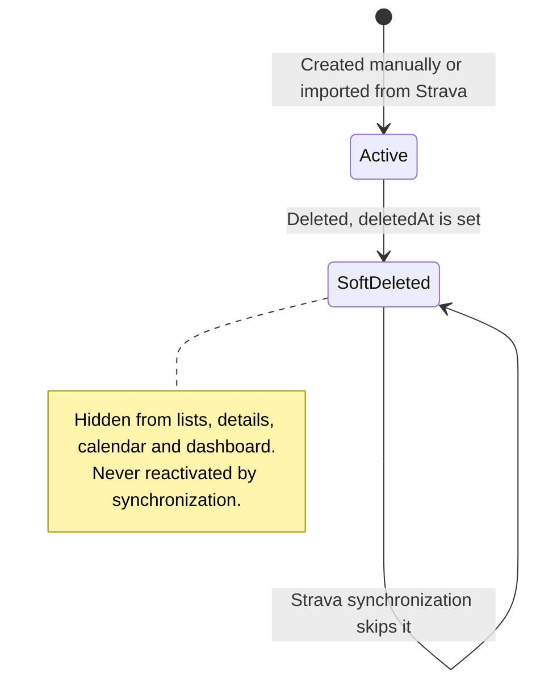

# Athlify – Activity Management Technical Details

Technical detail documentation for the functional concept in
[`CONCEPT.md`](CONCEPT.md).

These rules describe planned behavior. Activity management and Strava
synchronization are not implemented in the current repository.

## Views and functions

- List/table view with filtering and multi-activity selection.
- Detail view as an edit form.
- Calendar view with weekly summary inspired by TrainingPeaks.
- Full CRUD for manual and synchronized activities.
- Visible Strava sync button on the Activities page.
- Display of the last synchronization time and a possible error status.

## Editability

All functional input fields are editable unless they are calculated or system-managed. System and calculated fields are marked with `*` and displayed as read-only in the form.

Non-editable fields:

- `id`
- `averageSpeed`
- `tss`
- `source`
- `stravaActivityId`
- `createdAt`
- `modifiedAt`
- `mergeId`
- `deletedAt`

## Soft delete and Strava synchronization

Deleted activities are not physically removed. Instead, `deletedAt` is set.
Normal lists, detail views, calendar views and dashboard analyses include only
active activities. During Strava synchronization, an activity that was already
soft-deleted must not be created or reactivated as an active activity.
Synchronization matches external references within the authenticated owner
context and reports failures explicitly.

## Activity fields

| Field | Type/relationship | Editable |
|---|---|:---:|
| `id`* | internal ID | No |
| `userId` | owner | No |
| `date` | date and start time | Yes |
| `type` | enum or activity type | Yes |
| `vehicleId` | optional bicycle | Yes |
| `gadgetIds` | n:m to gadgets | Yes |
| `mergeId`* | optional merge, set by merging | No |
| `time` | duration | Yes |
| `distance` | distance | Yes |
| `averageSpeed`* | calculated value | No |
| `elevationGain` | elevation gain | Yes/imported |
| `tss`* | calculated Training Stress Score | No |
| `description` | description | Yes |
| `tags` | n:m to the user's tags | Yes |
| `heartRateMin` | minimum heart rate | Yes/imported |
| `heartRateMax` | maximum heart rate | Yes/imported |
| `heartRateAverage` | average heart rate | Yes/imported |
| `mood` | personal mood | Yes |
| `effort` | subjective effort | Yes |
| `wind` | wind conditions | Yes/imported |
| `source`* | Strava or manual | No |
| `stravaActivityId`* | external Strava reference | No |
| `createdAt`* | creation timestamp | No |
| `modifiedAt`* | modification timestamp | No |
| `deletedAt`* | soft-delete timestamp | No |

## Merging activities

Activities can be merged through a separate merge record. A merge contains at
least two activities, and an activity belongs to at most one merge. The
original activities remain available and can still be displayed individually.
If fewer than two active activities remain, the merge is dissolved. See
[`data-model.md`](data-model.md#activity-merges).

At least the following values are aggregated for the merged representation:

- Time
- Distance
- Elevation gain
- TSS

## Calendar weekly summary

The calendar view groups activities by calendar week. At minimum, distance, time, elevation gain and TSS are summarized per week. The values respect the same filters as the list and dashboard views.

## Open technical learning points

- Check how Indoor and Outdoor activities from Strava can be distinguished reliably.
- Define how TSS is calculated when no power or heart-rate data is available.
