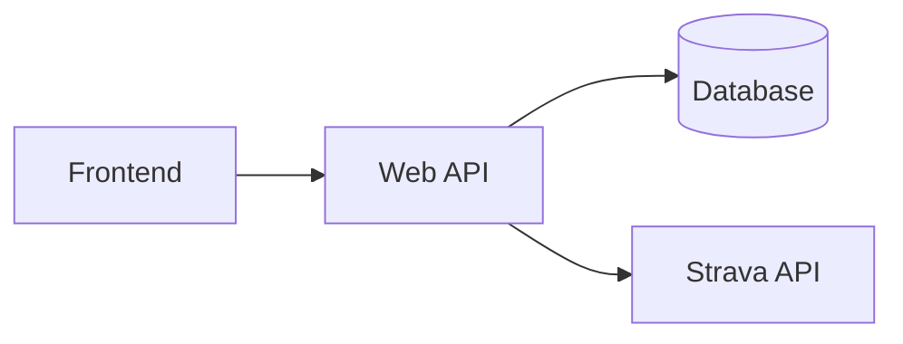

# Athlify – Architecture

Technical detail documentation for the functional concept in [`docs/athlify_concept.md`](../athlify_concept.md).

## Architecture overview

Athlify consists of a frontend, a web API and a database. The frontend communicates with the backend. The backend processes domain rules, stores personal data and integrates with Strava.



## Domain modules

- Authentication and user administration
- Activities
- Strava synchronization
- Garage with bicycles and gadgets
- Body-Stats
- Events
- Dashboard and analyses

## Data flow

1. The user logs in.
2. The frontend sends domain requests to the backend.
3. The backend checks the user and permissions.
4. The domain logic reads or changes the personal data.
5. Dashboard analyses are built from activities, Body-Stats and events.

## Folder structure

```text
athlify/
├── frontend/
├── backend/
├── database/
└── docs/
```
