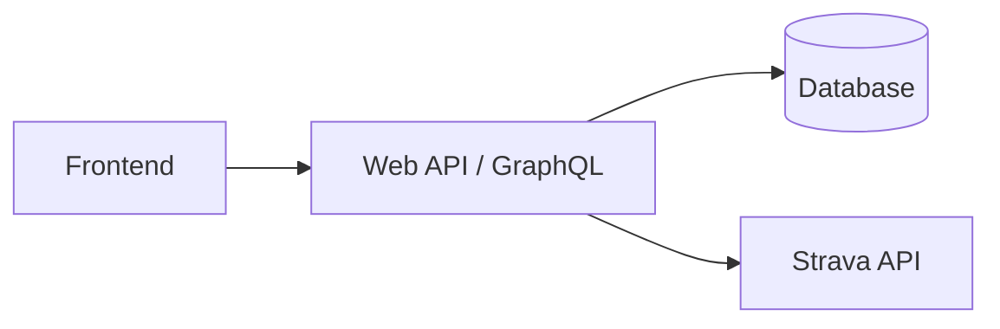

# Athlify – Architecture

Technical detail documentation for the functional concept in [`CONCEPT.md`](CONCEPT.md).

## Architecture overview

Athlify consists of a frontend, a web API and a database. The frontend communicates with the backend. The backend processes domain rules, stores personal data and integrates with Strava.

This is the planned architecture. The current repository contains a
React/TypeScript frontend app shell and a GraphQL backend prototype with
Body-Stats operations on an in-memory database. There is no authentication,
persistent database or Strava integration yet, and the frontend does not call
the backend.



## Domain modules

- Authentication and user administration, including the provisioned
  Administrator role
- Activities
- Strava synchronization
- Garage with bicycles and gadgets
- Body-Stats
- Events
- Dashboard and analyses

## Data flow

1. The user logs in.
2. The frontend sends domain requests to the backend.
3. The backend checks the user and permissions.
4. The domain logic reads or changes the personal data.
5. Dashboard analyses are built from activities, Body-Stats and events.

## Folder structure

```text
athlify/
├── docs/concept/            # functional and technical concept
├── docs/copilot/            # implementation context, PRD/SAD, ADRs, learnings
├── src/backend/             # .NET solution: Athlify.Api and Athlify.Api.Tests
├── src/frontend/athlify/    # React/TypeScript/Vite app (npm workspace)
├── package.json             # npm workspace root and Lefthook install
└── lefthook.yml             # pre-commit hooks for frontend format/lint/typecheck
```

Database, reverse proxy and Strava integration boundaries are still planned.
Introduce them deliberately rather than inferring them from the current tree.
