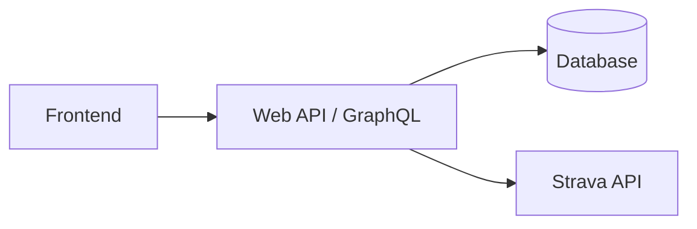
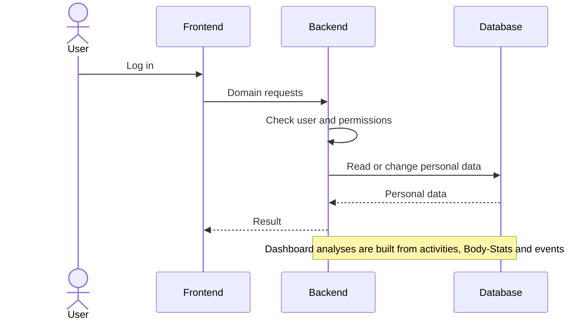

# Athlify – Architecture

Technical detail documentation for the functional concept in [`CONCEPT.md`](CONCEPT.md).

## Architecture overview

Athlify consists of a frontend, a web API and a database. The frontend communicates with the backend. The backend processes domain rules, stores personal data and integrates with Strava.

This is the planned architecture. The current repository contains a
React/TypeScript frontend app shell and a GraphQL backend with the
owner-scoped domain model (Activities, merges, Garage, tags, Body-Stats and
Events). There is no authentication, Strava integration or Dashboard analysis
yet. The Body-Stats page of the frontend calls the backend; the other areas
are placeholders.


```mermaid
flowchart LR
    FE[Frontend] --> API[Web API / GraphQL]
    API --> DB[(Database)]
    API --> STRAVA[Strava API]
```

## Domain modules

- Authentication and user administration, including the provisioned
  Administrator role
- Activities
- Strava synchronization
- Garage with bicycles and gadgets
- Body-Stats
- Events
- Dashboard and analyses

## Data flow


```mermaid
sequenceDiagram
    actor User
    participant FE as Frontend
    participant BE as Backend
    participant DB as Database
    User->>FE: Log in
    FE->>BE: Domain requests
    BE->>BE: Check user and permissions
    BE->>DB: Read or change personal data
    DB-->>BE: Personal data
    BE-->>FE: Result
    Note over BE,DB: Dashboard analyses are built from activities, Body-Stats and events
```

## Folder structure

```text
athlify/
├── docs/concept/            # functional and technical concept
├── docs/copilot/            # implementation context, PRD/SAD, ADRs, learnings
├── src/backend/             # .NET solution: Athlify.Api and Athlify.Api.Tests
└── src/frontend/athlify/    # React/TypeScript/Vite app (standalone npm package)
```

Database, reverse proxy and Strava integration boundaries are still planned.
Introduce them deliberately rather than inferring them from the current tree.
