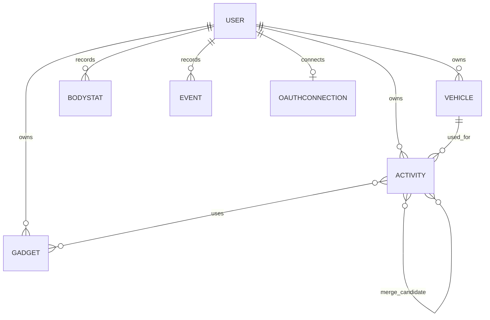

# Athlify – Data Model

Technical detail documentation for the functional concept in [`CONCEPT.md`](CONCEPT.md).

This is the planned domain model. No entities or persistence implementation
currently exist in the repository; the frontend scaffold does not implement
domain data storage.

## Entities

- **User**: email, password hash, personal details and language.
- **Activity**: date, type enum, bicycle, gadgets, time, distance, average
  speed, elevation gain, TSS, description, tag, minimum/maximum/average heart
  rate, mood, effort, wind, source, external Strava ID and system timestamps.
- **Vehicle**: brand, model, nickname, purchase date, tag, description,
  deactivation date, price, maintenance cycle and source.
- **Gadget**: brand, model, nickname, purchase date, tag, description,
  deactivation date, price, maintenance cycle and source.
- **MaintenanceCycle**: a separate maintenance schedule associated with a
  vehicle or gadget.
- **BodyStat**: measurement date, weight, body height and optional note.
- **Event**: date, type, title and description.
- **OAuthConnection**: connection of a user with Strava and synchronization status.
- **Role**: user role distinguishing regular users from Administrators. An
  Administrator retains all regular-user permissions and gains user-management
  permissions.

## Relationships

- A user owns any number of activities, bicycles, gadgets, Body-Stats and events.
- An activity can optionally be assigned to a bicycle.
- An activity can be assigned to multiple gadgets.
- A bicycle can be linked to multiple gadgets, and a gadget can be linked to
  multiple bicycles.
- A maintenance cycle belongs to a vehicle or gadget and can be opened to
  filter the linked equipment.
- Activities can be grouped in a merge through a separate relationship; the
  final cardinality remains an open product decision.
- A soft-deleted activity remains with its deletion timestamp and is hidden from
  normal views and synchronization. A later Strava synchronization must not
  reactivate it.
- A user can have a Strava connection.
- All domain records contain a unique user reference.

## Activity fields

| Field              |   Editable   | Description                                          |
| ------------------ | :----------: | ---------------------------------------------------- |
| `id`*              |      No      | Unique internal identifier                           |
| `date`             |     Yes      | Date and start time                                  |
| `type`             |     Yes      | Activity type, e.g. road bike, MTB, gravel or indoor |
| `vehicleId`        |     Yes      | Assigned bicycle                                     |
| `gadgetIds`        |     Yes      | Gadgets used                                         |
| `time`             |     Yes      | Activity duration                                    |
| `distance`         |     Yes      | Distance                                             |
| `averageSpeed`*    |      No      | Average speed calculated from time and distance      |
| `elevationGain`    | Yes/imported | Elevation gain                                       |
| `tss`*             |      No      | Calculated Training Stress Score                     |
| `description`      |     Yes      | Description or note                                  |
| `tags`             |     Yes      | Freely selectable tags                               |
| `heartRateMin`     | Yes/imported | Minimum heart rate                                   |
| `heartRateMax`     | Yes/imported | Maximum heart rate                                   |
| `heartRateAverage` | Yes/imported | Average heart rate                                   |
| `mood`             |     Yes      | Personal mood                                        |
| `effort`           |     Yes      | Subjective effort                                    |
| `wind`             | Yes/imported | Wind conditions                                      |
| `source`           |      No      | Activity source: Strava or manual                    |
| `stravaActivityId` |      No      | External reference for Strava activities             |
| `createdAt`*       |      No      | Creation timestamp                                   |
| `updatedAt`*       |      No      | Last modification timestamp                          |
| `deletedAt`*       |      No      | Soft-delete timestamp; empty for active activities   |

An asterisk marks system or calculated data. These fields are displayed but
cannot be edited directly through the form. The exact calculation and
validation rules for TSS and other derived values remain open.

## Activity merges

A merge consists of at least two activities. The assignment is stored in a
separate link so that the original records are retained. Whether an activity
may participate in multiple merges or whether membership is exclusive remains
an open product decision. The merged representation can display calculated
totals for time, distance, elevation gain and TSS.

## Example activity structure

```text
Activity
├── id*
├── date
├── type
├── vehicle
├── gadgets[]
├── time
├── distance
├── averageSpeed*
├── elevationGain
├── tss*
├── description
├── tags[]
├── heartRate: { min, max, average }
├── mood
├── effort
├── wind
├── source
├── stravaActivityId
├── createdAt*
├── updatedAt*
└── deletedAt*
```


