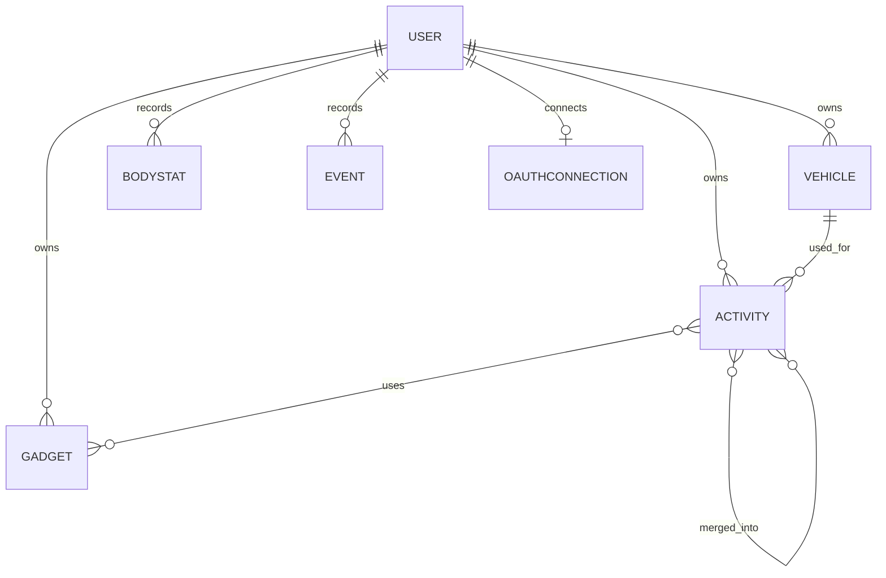

# Athlify – Data Model

Technical detail documentation for the functional concept in [`docs/athlify_concept.md`](../athlify_concept.md).

## Entities

- **User**: email, password hash, personal details and language.
- **Activity**: date, type, bicycle, gadgets, time, distance, average speed, elevation gain, TSS, description, tags, heart rate, mood, effort, wind, source, external Strava ID and system timestamps.
- **Vehicle**: name, type, brand, model, weight, purchase date, mileage and source.
- **Gadget**: name, category, brand, model, purchase date and description.
- **BodyStat**: measurement date, weight, body height and optional note.
- **Event**: date, type, title and description.
- **OAuthConnection**: connection of a user with Strava and synchronization status.
- **Role**: user role for optional administration.

## Relationships

- A user owns any number of activities, bicycles, gadgets, Body-Stats and events.
- An activity can optionally be assigned to a bicycle.
- An activity can be assigned to multiple gadgets.
- Activities can be grouped in a merge through an n:n relationship.
- A soft-deleted activity remains with its deletion timestamp and is hidden from normal views and synchronization.
- A user can have a Strava connection.
- All domain records contain a unique user reference.

## Activity fields

| Field | Editable | Description |
|---|:---:|---|
| `id`* | No | Unique internal identifier |
| `date` | Yes | Date and start time |
| `type` | Yes | Activity type, e.g. road bike, MTB, gravel or indoor |
| `vehicleId` | Yes | Assigned bicycle |
| `gadgetIds` | Yes | Gadgets used |
| `time` | Yes | Activity duration |
| `distance` | Yes | Distance |
| `averageSpeed`* | No | Average speed calculated from time and distance |
| `elevationGain` | Yes/imported | Elevation gain |
| `tss`* | No | Calculated Training Stress Score |
| `description` | Yes | Description or note |
| `tags` | Yes | Freely selectable tags |
| `heartRateMin` | Yes/imported | Minimum heart rate |
| `heartRateMax` | Yes/imported | Maximum heart rate |
| `heartRateAverage` | Yes/imported | Average heart rate |
| `mood` | Yes | Personal mood |
| `effort` | Yes | Subjective effort |
| `wind` | Yes/imported | Wind conditions |
| `source` | No | Activity source: Strava or manual |
| `stravaActivityId` | No | External reference for Strava activities |
| `createdAt`* | No | Creation timestamp |
| `updatedAt`* | No | Last modification timestamp |
| `deletedAt`* | No | Soft-delete timestamp; empty for active activities |

An asterisk marks system or calculated data. These fields are displayed but cannot be edited directly through the form.

## Activity merges

A merge consists of at least two activities. The assignment is stored in a separate link so that an activity can participate in multiple merges and the original records are retained. The merged representation can display calculated totals for time, distance, elevation gain and TSS.

## Example activity structure

```text
Activity
├── id*
├── date
├── type
├── vehicle
├── gadgets[]
├── time
├── distance
├── averageSpeed*
├── elevationGain
├── tss*
├── description
├── tags[]
├── heartRate: { min, max, average }
├── mood
├── effort
├── wind
├── source
├── stravaActivityId
├── createdAt*
├── updatedAt*
└── deletedAt*
```


