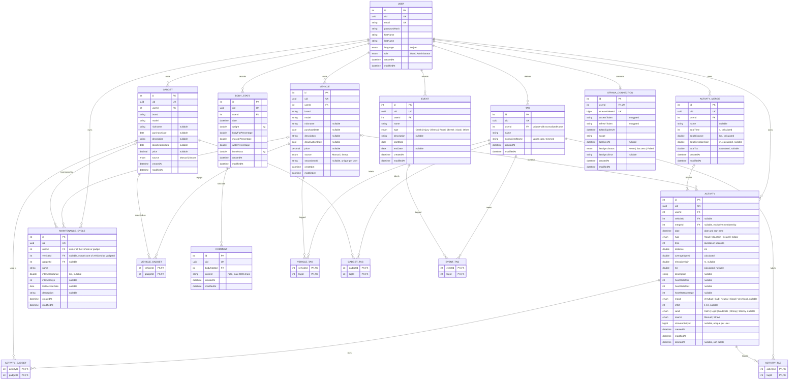

# Athlify – Data Model

Technical detail documentation for the functional concept in [`CONCEPT.md`](CONCEPT.md).

The backend implements this model in PostgreSQL with EF Core migrations and
exposes it through the GraphQL API. Authentication and Strava synchronization
are not implemented yet: every request acts as a provisioned development
user, and the Strava fields are only filled by the future synchronization.
See the [backend SAD](../copilot/backend/SAD.md) for the current state. The
frontend does not store domain data. The modelling decisions are recorded in
[ADR-008](../copilot/adr/ADR-008-domain-data-model.md) (tags, merges,
equipment), [ADR-009](../copilot/adr/ADR-009-ownership-query-filters.md)
(ownership) and
[ADR-010](../copilot/adr/ADR-010-activity-and-event-value-domains.md) (value
domains).

## Conventions

- Every entity has an internal `id` (exposed as a Relay global ID, see
  [ADR-006](../copilot/adr/ADR-006-relay-global-ids.md)), a stable `uid` and
  the system timestamps `createdAt` and `modifiedAt`. Join tables have only a
  composite key.
- Every personal record belongs to exactly one user (`userId`), directly or
  through its parent record. A record of another user behaves like a record
  that does not exist.
- External Strava IDs are stored separately from internal IDs.
- Enum values are stored as strings.

## Entities

- **User**: email, password hash, first and last name, language and role.
  The role is an enum (`User`, `Administrator`); an Administrator retains all
  regular-user permissions and gains user-management permissions.
- **StravaConnection**: a user's Strava connection with Strava athlete ID,
  encrypted tokens, scope and synchronization status (last synchronization
  time, status and error).
- **Activity**: see [Activity fields](#activity-fields).
- **ActivityMerge**: a group of at least two activities shown as one merged
  representation; see [Activity merges](#activity-merges).
- **Vehicle**: brand, model, nickname, purchase date, tags, description,
  deactivation date, price, source and external Strava gear ID.
- **Gadget**: brand, model, nickname, purchase date, tags, description,
  deactivation date, price and source.
- **MaintenanceCycle**: a maintenance schedule of exactly one vehicle or
  gadget with `name`, `intervalDistance` (km), `intervalDays`,
  `lastServiceDate` and `description`. At least one interval is set.
- **BodyStats**: measurement date, weight, body-fat percentage, muscle
  percentage, water percentage and bone mass.
- **Note**: free text with creation and modification timestamps, attached to
  one Body-Stats entry and stored as `Comment`. The product has one note per
  Body-Stats entry; the API keeps a list and validates at most one.
- **Event**: name, type, description, tags, start date and optional end
  date. The type is one of `Crash`, `Injury`, `Illness`, `Repair`, `Break`,
  `Goal` and `Other`.
- **Tag**: a label defined per user. One tag can be assigned to activities,
  vehicles, gadgets and Events, so the Dashboard tag filter works across them.
  Names are unique per user, ignoring case and surrounding spaces.

## Relationships

- A user owns any number of activities, merges, vehicles, gadgets, Body-Stats,
  Events and tags, and has at most one Strava connection.
- An activity can optionally be assigned to a vehicle.
- An activity can be assigned to multiple gadgets, and a gadget to multiple
  activities.
- A vehicle can be linked to multiple gadgets, and a gadget can be linked to
  multiple vehicles.
- A maintenance cycle belongs to exactly one vehicle or one gadget; a vehicle
  or gadget can have several maintenance cycles. Opening a maintenance cycle
  filters the Garage to the linked equipment.
- An activity belongs to at most one merge; a merge groups at least two
  activities.
- Activities, vehicles, gadgets and Events can carry any number of tags.
- Events are not linked to activities; the Dashboard timeline relates them by
  date.
- A Body-Stats entry has at most one note; deleting the entry deletes its note.
- A soft-deleted activity remains with its deletion timestamp and is hidden from
  normal views and synchronization. A later Strava synchronization must not
  reactivate it.

## Activity fields

| Field              |   Editable   | Description                                          |
| ------------------ | :----------: | ---------------------------------------------------- |
| `id`*              |      No      | Unique internal identifier                           |
| `date`             |     Yes      | Date and start time                                  |
| `type`             |     Yes      | Activity type, e.g. road bike, MTB, gravel or indoor |
| `vehicleId`        |     Yes      | Assigned bicycle                                     |
| `gadgetIds`        |     Yes      | Gadgets used                                         |
| `mergeId`*         |      No      | Merge the activity belongs to; set by merging        |
| `time`             |     Yes      | Activity duration                                    |
| `distance`         |     Yes      | Distance                                             |
| `averageSpeed`*    |      No      | Average speed calculated from time and distance      |
| `elevationGain`    | Yes/imported | Elevation gain                                       |
| `tss`*             |      No      | Calculated Training Stress Score                     |
| `description`      |     Yes      | Description or note                                  |
| `tags`             |     Yes      | The user's tags (n:m to Tag)                         |
| `heartRateMin`     | Yes/imported | Minimum heart rate                                   |
| `heartRateMax`     | Yes/imported | Maximum heart rate                                   |
| `heartRateAverage` | Yes/imported | Average heart rate                                   |
| `mood`             |     Yes      | `VeryBad`, `Bad`, `Neutral`, `Good` or `VeryGood`    |
| `effort`           |     Yes      | Subjective effort from 1 to 10                       |
| `wind`             | Yes/imported | `Calm`, `Light`, `Moderate`, `Strong` or `Stormy`    |
| `source`           |      No      | Activity source: Strava or manual                    |
| `stravaActivityId` |      No      | External reference for Strava activities             |
| `createdAt`*       |      No      | Creation timestamp                                   |
| `modifiedAt`*      |      No      | Last modification timestamp                          |
| `deletedAt`*       |      No      | Soft-delete timestamp; empty for active activities   |

An asterisk marks system or calculated data. These fields are displayed but
cannot be edited directly through the form. `averageSpeed` is distance
divided by time in km/h. The calculation of TSS remains open; until it is
decided, `tss` stays empty.

## Activity merges

A merge consists of at least two activities. The assignment is stored as
`mergeId` on the activity so that the original records are retained.
Membership is exclusive: an activity belongs to at most one merge, and adding
an activity that is already merged to another merge is rejected. If fewer than
two active activities remain in a merge, for example after a soft delete, the
merge is dissolved. The merged representation displays calculated totals for
time, distance, elevation gain and TSS of its active activities. The totals
are stored on the merge and recalculated whenever a member is added, removed,
changed or soft-deleted; a total of values that are all missing stays empty.

## Entity relationship diagram

Join tables (`ACTIVITY_GADGET`, `VEHICLE_GADGET` and the `*_TAG` tables) are
persistence details; the API exposes them as list fields such as
`Activity.gadgets` or `Activity.tags`.

```mermaid
erDiagram
    USER ||--o{ ACTIVITY : owns
    USER ||--o{ ACTIVITY_MERGE : owns
    USER ||--o{ VEHICLE : owns
    USER ||--o{ GADGET : owns
    USER ||--o{ BODY_STATS : records
    USER ||--o{ EVENT : records
    USER ||--o{ TAG : defines
    USER ||--o| STRAVA_CONNECTION : connects
    USER ||--o{ MAINTENANCE_CYCLE : owns

    VEHICLE |o--o{ ACTIVITY : "used for"
    ACTIVITY_MERGE |o--|{ ACTIVITY : groups
    ACTIVITY ||--o{ ACTIVITY_GADGET : uses
    GADGET ||--o{ ACTIVITY_GADGET : "used in"
    VEHICLE ||--o{ VEHICLE_GADGET : equips
    GADGET ||--o{ VEHICLE_GADGET : "mounted on"
    VEHICLE |o--o{ MAINTENANCE_CYCLE : "maintained by"
    GADGET |o--o{ MAINTENANCE_CYCLE : "maintained by"
    BODY_STATS ||--o{ COMMENT : "has note"

    TAG ||--o{ ACTIVITY_TAG : labels
    ACTIVITY ||--o{ ACTIVITY_TAG : tagged
    TAG ||--o{ VEHICLE_TAG : labels
    VEHICLE ||--o{ VEHICLE_TAG : tagged
    TAG ||--o{ GADGET_TAG : labels
    GADGET ||--o{ GADGET_TAG : tagged
    TAG ||--o{ EVENT_TAG : labels
    EVENT ||--o{ EVENT_TAG : tagged

    USER {
        int id PK
        uuid uid UK
        string email UK
        string passwordHash
        string firstName
        string lastName
        enum language "de | en"
        enum role "User | Administrator"
        datetime createdAt
        datetime modifiedAt
    }
    STRAVA_CONNECTION {
        int id PK
        int userId FK, UK
        bigint stravaAthleteId UK
        string accessToken "encrypted"
        string refreshToken "encrypted"
        datetime tokenExpiresAt
        string scope
        datetime lastSyncAt "nullable"
        enum lastSyncStatus "Never | Success | Failed"
        string lastSyncError "nullable"
        datetime createdAt
        datetime modifiedAt
    }
    ACTIVITY {
        int id PK
        uuid uid UK
        int userId FK
        int vehicleId FK "nullable"
        int mergeId FK "nullable, exclusive membership"
        datetime date "date and start time"
        enum type "Road | Mountain | Gravel | Indoor"
        int time "duration in seconds"
        double distance "km"
        double averageSpeed "calculated"
        double elevationGain "m, nullable"
        double tss "calculated, nullable"
        string description "nullable"
        int heartRateMin "nullable"
        int heartRateMax "nullable"
        int heartRateAverage "nullable"
        enum mood "VeryBad | Bad | Neutral | Good | VeryGood, nullable"
        int effort "1-10, nullable"
        enum wind "Calm | Light | Moderate | Strong | Stormy, nullable"
        enum source "Manual | Strava"
        bigint stravaActivityId "nullable, unique per user"
        datetime createdAt
        datetime modifiedAt
        datetime deletedAt "nullable, soft delete"
    }
    ACTIVITY_MERGE {
        int id PK
        uuid uid UK
        int userId FK
        string name "nullable"
        int totalTime "s, calculated"
        double totalDistance "km, calculated"
        double totalElevationGain "m, calculated, nullable"
        double totalTss "calculated, nullable"
        datetime createdAt
        datetime modifiedAt
    }
    ACTIVITY_GADGET {
        int activityId PK, FK
        int gadgetId PK, FK
    }
    VEHICLE {
        int id PK
        uuid uid UK
        int userId FK
        string brand
        string model
        string nickname "nullable"
        date purchaseDate "nullable"
        string description "nullable"
        date deactivationDate "nullable"
        decimal price "nullable"
        enum source "Manual | Strava"
        string stravaGearId "nullable, unique per user"
        datetime createdAt
        datetime modifiedAt
    }
    GADGET {
        int id PK
        uuid uid UK
        int userId FK
        string brand
        string model
        string nickname "nullable"
        date purchaseDate "nullable"
        string description "nullable"
        date deactivationDate "nullable"
        decimal price "nullable"
        enum source "Manual | Strava"
        datetime createdAt
        datetime modifiedAt
    }
    VEHICLE_GADGET {
        int vehicleId PK, FK
        int gadgetId PK, FK
    }
    MAINTENANCE_CYCLE {
        int id PK
        uuid uid UK
        int userId FK "owner of the vehicle or gadget"
        int vehicleId FK "nullable, exactly one of vehicleId or gadgetId"
        int gadgetId FK "nullable"
        string name
        double intervalDistance "km, nullable"
        int intervalDays "nullable"
        date lastServiceDate "nullable"
        string description "nullable"
        datetime createdAt
        datetime modifiedAt
    }
    BODY_STATS {
        int id PK
        uuid uid UK
        int userId FK
        datetime date
        double weight "kg"
        double bodyFatPercentage
        double musclePercentage
        double waterPercentage
        double boneMass "kg"
        datetime createdAt
        datetime modifiedAt
    }
    COMMENT {
        int id PK
        uuid uid UK
        int bodyStatsId FK
        string content "note, max 2000 chars"
        datetime createdAt
        datetime modifiedAt
    }
    EVENT {
        int id PK
        uuid uid UK
        int userId FK
        string name
        enum type "Crash | Injury | Illness | Repair | Break | Goal | Other"
        string description "nullable"
        date startDate
        date endDate "nullable"
        datetime createdAt
        datetime modifiedAt
    }
    TAG {
        int id PK
        uuid uid UK
        int userId FK "unique with normalizedName"
        string name
        string normalizedName "upper case, trimmed"
        datetime createdAt
        datetime modifiedAt
    }
    ACTIVITY_TAG {
        int activityId PK, FK
        int tagId PK, FK
    }
    VEHICLE_TAG {
        int vehicleId PK, FK
        int tagId PK, FK
    }
    GADGET_TAG {
        int gadgetId PK, FK
        int tagId PK, FK
    }
    EVENT_TAG {
        int eventId PK, FK
        int tagId PK, FK
    }
```

## Constraints

Rules that the diagram cannot express:

1. A merge has at least two activities.
2. A maintenance cycle has exactly one of `vehicleId` and `gadgetId`.
3. Join tables and `mergeId` only connect records of the same owner.
4. A Body-Stats entry holds at most one note (validated by the API).
5. `averageSpeed` and `tss` are calculated by the backend and are never
   client input.
6. `(userId, stravaActivityId)` and `(userId, stravaGearId)` are unique, which
   keeps Strava synchronization idempotent.
7. `(userId, normalizedName)` is unique for tags, so names are unique per
   user ignoring case.
8. Soft-deleted activities keep their links but are excluded from normal views,
   aggregates and merge totals.
9. A maintenance cycle has the same owner as its vehicle or gadget.
10. An Event's end date is not before its start date; a maintenance cycle has
    at least one interval.

## Delete behavior

| Deleted record | Effect |
|---|---|
| Vehicle | `vehicleId` of its activities (soft-deleted ones included) is cleared; links to gadgets and tags and its maintenance cycles are deleted |
| Gadget | Links to activities (soft-deleted ones included), vehicles and tags and its maintenance cycles are deleted |
| Tag | Its links are deleted; tagged records remain |
| Activity | Soft delete only (`deletedAt`); a merge left with fewer than two active activities is dissolved |
| Activity merge | The merge is dissolved; its activities remain and leave it |
| Body-Stats entry | Its note is deleted |
| Event | Its tag links are deleted |
| Strava connection | Imported activities and vehicles remain with source `Strava` |
| User | All records owned by the user are deleted |

## Open points

- How TSS is calculated (see [open questions](CONCEPT.md#12-open-questions)).
- Whether deleting a vehicle imported from Strava must prevent its re-import
  (see [open questions](CONCEPT.md#12-open-questions)).
