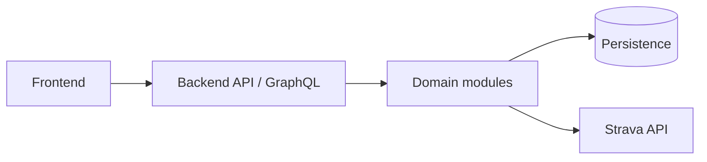

# Athlify — Software Architecture Document

**Project**: Athlify  
**Last Updated**: 2026-09-16
**Version**: 1.0

## Overview

Athlify is planned as a web application with a bilingual frontend, a backend
API, persistent personal data and a Strava integration. The current repository
contains only a small ASP.NET Core, Hot Chocolate GraphQL and EF Core InMemory
prototype, so planned architecture must not be presented as implemented
behavior.

This document is the canonical architecture entry point for the configured
documentation root.

## Architecture Style

The target is a modular application with separated frontend views, backend
domain areas, persistence and integration boundaries. The current prototype
does not yet realize the complete target architecture.

## System Components

## Technology Stack

| Layer | Technology | Status |
| --- | --- | --- |
| Frontend | React, TypeScript, Vite | Planned baseline |
| Backend | ASP.NET Core, Hot Chocolate GraphQL | Prototype |
| Database | PostgreSQL | Planned target |
| Prototype persistence | EF Core InMemory | Current prototype |
| Authentication | Backend-owned authentication and authorization | Planned |
| External integration | Strava API through backend synchronization | Planned |

See the [technology stack](../concept/technology-stack.md) and the
[backend SAD](backend/SAD.md) for detail.

## Key Components

### Frontend

Presents navigation, forms, views, filters, charts, local UI states and
accessible feedback. It does not own persistence, authorization or domain
calculations.

### Backend API

Exposes the frontend contract, validates requests, enforces authentication
and ownership, and delegates to domain modules and persistence.

### Domain Modules

The planned modules cover authentication and user assignment, Administrator
user management, Activities and Strava synchronization, Dashboard analysis,
Garage, Body-Stats and Events. Administrators retain the complete personal
user experience.

### Persistence and Integration Boundaries

Persistence owns durable personal records and synchronization state. Strava
is an external source whose identifiers, updates, duplicate handling and
deletion behavior must be reconciled by the backend.

## Data Flow

Authenticated frontend requests enter through the backend API, are checked
against the logged-in owner context, and are handled by the relevant domain
module and persistence boundary. Strava data enters through synchronization
before it is exposed to the frontend.

## Security Model

- Authentication is required for personal areas.
- Administrators have all regular-user permissions in addition to
  Administrator-only user management.
- Every server-side query and mutation enforces the owner context.
- Frontend filters never replace backend authorization.
- Credentials and tokens do not belong in source code, documentation,
  fixtures or logs.

See the [security concept](../concept/security.md) and
[backend SAD](backend/SAD.md).

## Detailed Architecture

- [Architecture overview](../concept/architecture.md)
- [Data model](../concept/data-model.md)
- [API design](../concept/api-design.md)
- [Activity management and synchronization](../concept/activity-management.md)
- [Frontend architecture](frontend/SAD.md)
- [Backend architecture](backend/SAD.md)

## ADR References

Cross-cutting decisions are indexed in
[`adr/README.md`](adr/README.md). Frontend- and backend-specific decisions
are indexed from the respective Copilot documentation.
