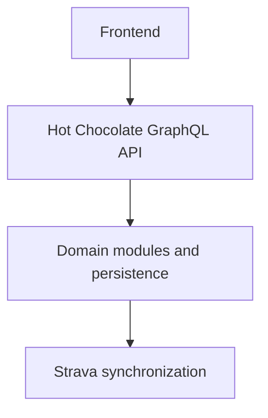

# Athlify Backend – Software Architecture Document

**Project**: Athlify
**Last Updated**: 2026-10-07
**Version**: 1.0

## Overview

Athlify's backend is the authoritative service for personal cycling data,
domain calculations, synchronization and the frontend API contract. The
repository contains the domain model with its GraphQL API; authentication,
Strava synchronization and the Dashboard analyses are not implemented yet.

## Architecture Style

The backend is a modular monolith with one folder per domain area under
`Domain/`, a shared EF Core DbContext as the data-access boundary and Hot
Chocolate resolvers as the API layer. Authentication, synchronization and
analytics will be added as further modules.

## Technology Stack

| Layer | Technology | Rationale |
| --- | --- | --- |
| Frontend | React, TypeScript, Vite and Relay | The Body-Stats page calls this API |
| Backend | ASP.NET Core (.NET 10) with Hot Chocolate GraphQL 16.6 | API style proposed in [shared ADR-001](../adr/ADR-001-graphql-api-contract.md) |
| Database | PostgreSQL through EF Core 10 and Npgsql (Aspire); EF Core InMemory in tests | Schema through EF Core migrations, applied at startup ([ADR-011](adr/ADR-011-ef-core-migrations.md)) |
| Tests | TUnit 1.x with `TUnit.AspNetCore` | Endpoint tests against `/graphql` |
| Auth | Backend-owned authentication and authorization (planned); ownership through EF Core query filters ([ADR-009](../adr/ADR-009-ownership-query-filters.md)) | Every request acts as a provisioned development user until authentication exists |
| Hosting | Open | Deployment architecture is not yet decided |

## System Components



## Scope

This document describes the technical context for changes to the repository. The functional big picture is in [`../../concept/CONCEPT.md`](../../concept/CONCEPT.md); technical decisions are listed in the concept documents.

## Current repository state

```text
src/backend/
├── Athlify.slnx                    # solution (API + tests)
├── dotnet-tools.json               # pinned dotnet-ef tool
├── Athlify.Api/
│   ├── Program.cs                  # DI, DbContext (not pooled), GraphQL, cost limits, migrate/provision/seed
│   ├── Database/
│   │   ├── AthlifyDbContext.cs     # DbSets, Owner and NotDeleted query filters, owner and timestamp stamping
│   │   ├── Configurations/         # keys, indexes, foreign keys and the check constraint per entity
│   │   ├── Migrations/             # EF Core migrations (InitialDomainModel)
│   │   └── DbSeeder.cs, DesignTimeDbContextFactory.cs
│   ├── Domain/
│   │   ├── Common/                 # Entity, Equipment, IOwned, Source, DomainErrors, ValidationErrors, Links, Projection
│   │   ├── Users/                  # User, ICurrentUser, DevelopmentCurrentUser, provisioner, `me`
│   │   ├── Body/                   # Body-Stats and their note
│   │   ├── Tags/  Vehicles/  Gadgets/  Activities/  Events/
│   │   └── Strava/                 # StravaConnection (stored, not exposed)
│   └── Properties/                 # launchSettings.json (http://localhost:5095), ModuleInfo.cs
└── Athlify.Api.Tests/              # TUnit endpoint tests, one InMemory database per test
```

- Target framework: `net10.0`, with nullable reference types and implicit
  usings enabled.
- Hot Chocolate source generation: `[QueryType]` / `[MutationType]` static
  partial classes are registered through `AddTypes()`, which is generated
  from `[assembly: Module("Types")]`.
- Each domain area has an entity, an `…Input` record, validation, a
  keyset-paged list query, create/update/delete mutations and a `node(id:)`
  resolver. Lists, mutation results and `node(id:)` are shaped by the
  GraphQL selection through `QueryContext<T>`, so nested selections such as
  an activity's bicycle with its tags are always loaded. The operations are
  listed in [`api-design.md`](../../concept/api-design.md).
- Models and inputs are separate. The **entity** is the stored model and also
  the GraphQL output type, so filtering, sorting, paging and `QueryContext`
  projection run on the EF query; it carries no API attributes except `[ID]`
  on `Entity.Id`. The **input** (`XInput`) is the only write model. How the API
  shows an entity (Relay node, hidden fields, filters) is configured in its
  `XObjectType` class. Output DTOs are only added where the data is not an
  entity, such as the future Dashboard results. One file per task:
  `X.cs` (entity), `XInput.cs`, `XValidation.cs`, `XObjectType.cs`, and the
  resolvers (`XQueries.cs`, `XMutations.cs`, `XNode.cs`, or one `XResolvers.cs`
  while it stays short). Bicycles and gadgets share the unmapped `Equipment`
  base.
- Ownership: `AthlifyDbContext` hides other users' records with the named
  query filter `Owner` and assigns new records to the signed-in user. The user
  comes only from `ICurrentUser`; `DevelopmentCurrentUser` returns the
  development Administrator that `DevelopmentUserProvisioner` creates at
  startup ([ADR-009](../adr/ADR-009-ownership-query-filters.md)).
- Activities are soft deleted (`NotDeleted` filter). `averageSpeed` and the
  merge totals are calculated by the domain code and stored.
- Validation rejects invalid input with `VALIDATION_ERROR`; a missing user
  gives `NOT_AUTHENTICATED`. Every rule is checked in application code; the
  database constraints are a backstop that the InMemory tests do not cover.
- At startup the API applies pending migrations, provisions the development
  user and seeds sample Body-Stats for it. `AppSettings.ShouldSeedDb` exists
  but is not read yet.
- There is no authentication, Strava synchronization or Dashboard analysis
  yet. The Strava connection is stored but not exposed.

## Backend responsibility

The backend is authoritative for authentication, authorization, ownership checks, persistence, domain calculations, Strava synchronization and the API/GraphQL contract. The frontend must not replace these rules.

## Target architecture

The application should grow into clearly separated domain areas:

1. Authentication and user assignment
2. Activities and Strava synchronization
3. Dashboard and analyses
4. Garage with bicycles and gadgets
5. Body-Stats
6. Events

Each area should separate domain logic, data access and presentation so that personal data is protected by the user context. The concrete folder structure and API design will be defined with each feature; do not introduce unjustified abstractions in advance.

## Key Components

### GraphQL API

- **Responsibility**: Expose validated queries and mutations for frontend
  consumers.
- **Interfaces**: Hot Chocolate schema and resolver contract.
- **Data ownership**: No independent ownership; delegates to domain and
  persistence boundaries.

### Domain modules

- **Responsibility**: Enforce ownership, calculations, synchronization and
  domain invariants for Activities, Dashboard, Garage, Body-Stats and Events.
- **Interfaces**: Resolvers per area plus small domain modules where rules
  span records (for example `MergeMembership`, `Links`).
- **Data ownership**: Personal domain records belong to one user context.

### Persistence

- **Responsibility**: Store domain records and synchronization state.
- **Interfaces**: `AthlifyDbContext` (EF Core 10, PostgreSQL); no repository
  layer on top.
- **Data ownership**: Durable personal records and external identifiers.

## Data rules

- Every personal entity has a unique owner.
- Queries, mutations and synchronizations must respect the owner context.
- Activities distinguish between manual and synchronized data.
- Calculated values such as average speed and TSS are not treated as freely editable inputs.
- Deleted synchronized Activities must not be unexpectedly reactivated by a later sync.
- Gadgets can be assigned to multiple Activities; a bicycle is optionally assigned to an Activity.
- Merges retain the original Activities traceably; an Activity belongs to at most one merge.
- Tags are managed per user and shared by Activities, bicycles, gadgets and Events.
- The target entities and relationships are defined in the ERD in
  [`data-model.md`](../../concept/data-model.md#entity-relationship-diagram)
  ([ADR-008](../adr/ADR-008-domain-data-model.md)).

## API contract

The contract must define clear queries/mutations, input validation, return data and error cases for Activities, Dashboard, Garage, Body-Stats and Events. Schema or input changes are reconciled with the frontend Copilot context and the technical documents under `../../concept/`.

## Integration boundaries

Strava is an external source. Synchronization must explicitly handle duplicate, update, deletion and error cases. External IDs must not be confused with internal IDs. Credentials or tokens do not belong in source code, documentation, fixtures or logs.

## Data Flow

Authenticated frontend requests enter through the GraphQL API, are checked
against the logged-in owner context, and are handled by the relevant domain
module and persistence boundary. Strava data enters through synchronization,
where external identifiers, duplicate handling, updates, deletions and errors
are reconciled before records are exposed to the frontend.

## External Integrations

| Service | Purpose | Authentication |
| ------- | ------- | -------------- |
| Strava | Import and update cycling activities | Backend-managed OAuth/token flow |

## Security Model

Authentication is required for personal areas. Authorization is not only a UI concern: every server-side query and mutation must check the user reference. Administrators have the same personal-area access as regular users and can
additionally manage user accounts. Administrator privileges must not expose
other users' personal data outside explicitly authorized user-management
operations.


## Scalability

- Current capacity: One PostgreSQL instance; lists are paged with at most 200
  records per page.
- Scaling strategy: Select deployment scaling once the deployment
  architecture is decided.
- Known bottlenecks: Nested lists are loaded through projections without
  DataLoaders; the query cost limits are raised to 10,000 for filtered pages.

## Development guardrails

- Before code changes, inspect existing types, resolvers and data models.
- Do not manually store states already managed by EF Core or Hot Chocolate without justification.
- Do not duplicate domain rules in UI-specific resolvers.
- Handle errors explicitly and clearly for users; do not use silent fallbacks.
- Keep changes to the schema or data model synchronized with affected tests and documents.
- Use the smallest existing build or test command that covers the change.

## Technical detail sources

- [`../../concept/technology-stack.md`](../../concept/technology-stack.md)
- [`../../concept/architecture.md`](../../concept/architecture.md)
- [`../../concept/data-model.md`](../../concept/data-model.md)
- [`../../concept/api-design.md`](../../concept/api-design.md)
- [`../../concept/activity-management.md`](../../concept/activity-management.md)
- [`../../concept/security.md`](../../concept/security.md)
- [`../../concept/testing-deployment.md`](../../concept/testing-deployment.md)
- [`../frontend/SAD.md`](../frontend/SAD.md)

## ADR References

See [`../adr/README.md`](../adr/README.md) for backend and shared decision
records.
